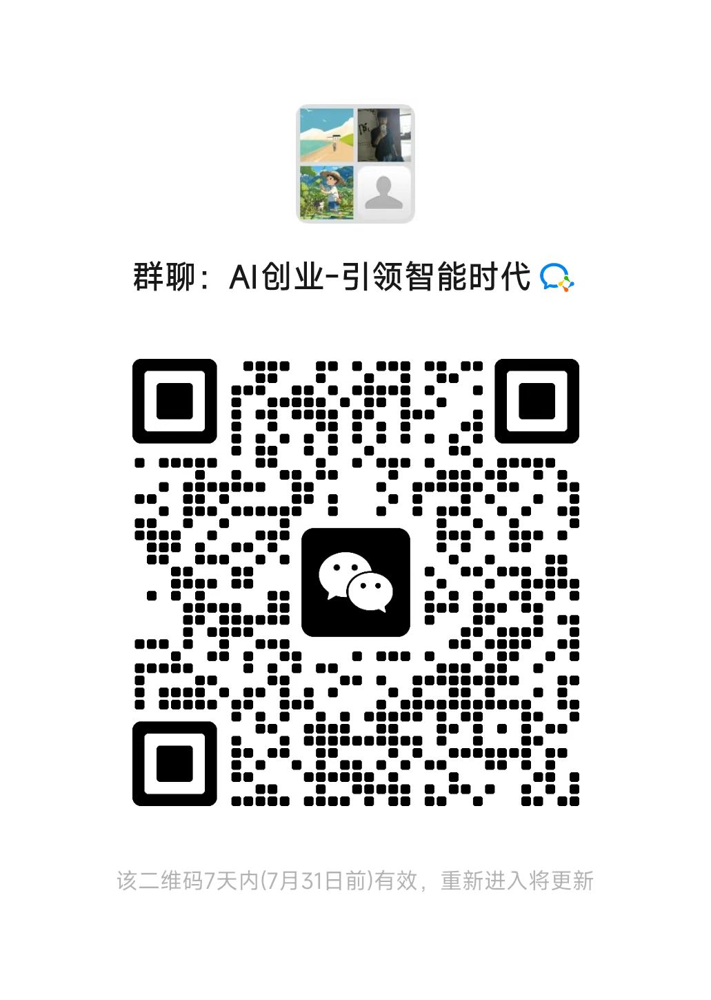

# 戒色助手 (NoFap Helper)

<div align=center>

</div>

<div align=center>


</div>

<div align=center>
<a href="https://trendshift.io/repositories/3250" target="_blank"></a>
</div>

[English](./README-en.md) | 简体中文

## 🎯 项目简介

**戒色助手** 是一个专注于帮助年轻人戒除色情内容依赖的游戏化健康管理应用。通过科学的评估体系、游戏化激励机制和社区互助功能，为用户提供全方位的戒色支持。

### 🌟 核心特色

- **科学评估**: 基于国际认可的性成瘾评估量表(SAST-R, PATHOS)设计
- **游戏化体验**: 50级等级系统 + 100+成就徽章 + 经验值奖励机制
- **社区互助**: 匿名社区环境，提供情感支持和实用建议
- **紧急求助**: 一键求助功能，关键时刻提供即时支持
- **个性化学习**: AI推荐系统，提供定制化的康复内容

## 🏗️ 技术架构

### 前端技术栈
- **小程序端**: uni-app X + Vue 3 + TypeScript + Pinia
- **管理端**: Vue 3 + Element Plus + Vite
- **UI设计**: 基于Tailwind CSS的自定义组件库
- **状态管理**: Pinia
- **开发工具**: Vite + TypeScript

### 后端技术栈
- **主要语言**: Go + Gin + GORM
- **数据库**: MySQL 8.0+ + Redis
- **架构模式**: MVC架构
- **认证方式**: JWT
- **API文档**: Swagger自动生成

## 🚀 快速开始

### 环境要求
```
- Node.js 18+
- Go 1.22+
- MySQL 8.0+
- Redis 6.0+
- 微信开发者工具
```

### 前端开发

#### 小程序端
```bash
cd frontend
npm install
npm run dev:mp-weixin  # 微信小程序开发
npm run dev:h5         # H5开发调试
```

#### 管理端
```bash
cd web
npm install
npm run serve
```

### 后端开发
```bash
cd server
go mod tidy
go run main.go
```

### 数据库初始化
```bash
# 使用MySQL客户端连接数据库
mysql -u root -p123456

# 创建数据库
CREATE DATABASE gva_nofap CHARACTER SET utf8mb4 COLLATE utf8mb4_unicode_ci;

# 运行数据库迁移脚本
cd server
go run main.go
```

## 📱 核心功能

### 1. 色隐指数评估系统
- 50题科学评估问卷
- 5级风险等级判定
- 评估历史记录追踪
- 定期复评提醒机制

### 2. 游戏化激励系统
- **等级系统**: 50个等级，对应不同戒色里程碑
- **经验值机制**: 每日签到、任务完成、社区贡献
- **成就系统**: 100+个成就徽章
- **虚拟奖励**: 主题皮肤、专属头像、个性化称号

### 3. 每日打卡功能
- 每日签到记录
- 情绪状态评估
- 连续天数统计
- 打卡历史查看

### 4. 社区互助功能
- 匿名发帖系统
- 内容分类管理
- 点赞评论功能
- AI+人工内容审核

### 5. 紧急求助系统
- 一键紧急求助
- 注意力转移活动
- 社区志愿者响应
- 专业资源推荐

### 6. 学习成长模块
- 个性化内容推荐
- 文章/视频/音频内容
- 学习进度追踪
- 内容收藏功能

### 7. 数据分析报告
- 进度统计可视化
- 情绪变化趋势
- 成功率分析
- 个人成长报告

## 🎨 设计规范

### 视觉设计原则
- **温暖友好**: 使用温暖的色彩搭配，避免冷酷感
- **私密安全**: 界面设计体现隐私保护，降低用户心理压力
- **游戏化视觉**: 加入游戏元素，但保持专业性
- **简洁明了**: 信息层次清晰，操作路径简单

### 色彩规范
- **主色调**: #34D399 (温暖翠绿色)
- **次色调**: #06B6D4 (清新天蓝色)
- **强调色**: #F59E0B (活力琥珀色)
- **背景色**: #F8FAFC (浅灰白色，护眼舒适)
- **紧急色**: #EF4444 (活力红色，仅用于紧急按钮)

## 📱 原型图展示

### 欢迎页面
<div align=center>

</div>

### 色隐指数评估
<div align=center>

</div>

### 首页Dashboard
<div align=center>

</div>

### 每日打卡
<div align=center>

</div>

### 进度追踪
<div align=center>

</div>

### 社区互助
<div align=center>

</div>

### 紧急求助
<div align=center>

</div>

### 学习成长
<div align=center>

</div>

### 个人中心
<div align=center>

</div>

## 📊 项目结构

```
gva_NoFap/
├── frontend/                 # 前端小程序代码
│   ├── src/
│   │   ├── pages/           # 页面文件
│   │   │   ├── welcome/     # 欢迎页面
│   │   │   ├── assessment/  # 评估页面
│   │   │   ├── checkin/     # 打卡页面
│   │   │   ├── community/   # 社区页面
│   │   │   ├── emergency/   # 紧急求助
│   │   │   ├── learning/    # 学习页面
│   │   │   ├── progress/    # 进度页面
│   │   │   └── profile/     # 个人中心
│   │   ├── components/      # 组件
│   │   ├── store/          # 状态管理
│   │   ├── api/            # API接口
│   │   └── utils/          # 工具函数
│   ├── manifest.json       # 应用配置
│   ├── pages.json         # 页面路由配置
│   └── package.json
├── server/                  # 后端服务代码
│   ├── api/               # API控制器
│   │   ├── v1/
│   │   │   ├── miniprogram/  # 小程序API
│   │   │   └── system/       # 系统管理API
│   ├── model/             # 数据模型
│   │   ├── miniprogram/   # 小程序业务模型
│   │   └── system/        # 系统管理模型
│   ├── service/           # 业务逻辑
│   ├── router/            # 路由配置
│   ├── middleware/        # 中间件
│   └── config/            # 配置文件
├── web/                    # 管理端代码
│   ├── src/
│   │   ├── view/          # 页面
│   │   ├── components/    # 组件
│   │   ├── api/          # API接口
│   │   └── router/       # 路由
└── docs/                  # 项目文档
    ├── PRD.md            # 产品需求文档
    ├── Database_Schema.md # 数据库设计文档
    └── API.md            # API接口文档
```

## 🗄️ 数据库设计

### 核心业务表
1. **用户表** (users) - 用户基本信息
2. **戒色记录表** (abstinence_records) - 戒色进度追踪
3. **评估结果表** (assessment_results) - 色隐指数评估
4. **每日打卡表** (daily_checkins) - 打卡记录
5. **社区动态表** (community_posts) - 社区内容
6. **成就表** (achievements) - 成就系统
7. **学习内容表** (learning_contents) - 学习资源
8. **紧急求助表** (emergency_requests) - 求助记录

## 📈 产品指标

### 核心KPI
- **日活跃用户数 (DAU)**: 目标 1万+ (6个月内)
- **用户留存率**: 次日留存>70%，7日留存>45%
- **戒色成功率**: 30天成功率>60%，90天成功率>35%
- **社区活跃度**: 每日发帖量>500条，用户参与率>40%

### 北极星指标
**用户累计戒色天数总和** - 直接体现产品帮助用户实现戒色目标的核心价值

## 🔧 开发规范

### 代码规范
- 前端遵循Vue 3 Composition API规范
- 后端遵循Go标准代码规范
- 统一使用TypeScript/Go的严格类型检查

### 提交规范
- `feat`: 新功能
- `fix`: 修复bug
- `docs`: 文档更新
- `style`: 代码格式调整
- `refactor`: 代码重构
- `test`: 测试相关
- `chore`: 构建过程或辅助工具的变动

## 🚀 部署说明

### 开发环境
- **前端**: HBuilderX + 微信开发者工具
- **后端**: GoLand/VSCode + MySQL + Redis
- **管理端**: VSCode + Chrome

### 生产环境
- **服务器**: 腾讯云/阿里云
- **数据库**: 云数据库MySQL
- **缓存**: 云数据库Redis  
- **CDN**: 腾讯云COS/阿里云OSS
- **部署**: Docker + Docker Compose

## 📋 开发任务

本项目使用TaskMaster AI进行任务管理，包含25个主要开发任务：

### 当前进度
- ✅ **任务1: 项目基础架构搭建** - 已完成
- ✅ **任务2: 数据库设计与实现** - 已完成
- 🔄 **任务3: 用户认证系统** - 进行中

### 完整任务列表
1. 项目基础架构搭建 ✅
2. 数据库设计与实现 ✅
3. 用户认证系统 🔄
4. 前端基础UI组件库
5. 欢迎页面实现
6. 色隐指数评估系统
7. 每日打卡功能
8. 游戏化激励系统
9. 首页Dashboard实现
10. 进度追踪页面
11. 社区互助功能
12. 社区页面UI实现
13. 紧急求助系统
14. 紧急求助页面UI
15. 学习内容管理系统
16. 学习页面UI实现
17. 个人中心功能
18. 个人中心页面UI
19. 管理端用户管理功能
20. 管理端内容管理功能
21. API接口文档和测试
22. 安全性加固和优化
23. 小程序审核准备
24. 部署和上线
25. 用户测试和反馈收集

## 🤝 贡献指南

我们欢迎所有形式的贡献！请阅读我们的贡献指南：

1. Fork 本仓库
2. 创建您的特性分支 (`git checkout -b feature/AmazingFeature`)
3. 提交您的更改 (`git commit -m 'Add some AmazingFeature'`)
4. 推送到分支 (`git push origin feature/AmazingFeature`)
5. 打开一个 Pull Request

## 💬 加入我们

如果您对戒色助手项目感兴趣，欢迎加入我们的微信群进行交流讨论！

<div align=center>

</div>

**群聊: AI创业-引领智能时代**

> 该二维码7天内有效，重新进入将更新

## 📄 许可证

本项目采用 MIT 许可证 - 查看 [LICENSE](LICENSE) 文件了解详情

## 📞 联系我们

- **项目主页**: [https://github.com/mobilesec110/gva_nofap](https://github.com/mobilesec110/gva_nofap)
- **问题反馈**: [Issues](https://github.com/mobilesec110/gva_nofap/issues)
- **功能建议**: [Discussions](https://github.com/mobilesec110/gva_nofap/discussions)

## 🙏 致谢

感谢所有为这个项目做出贡献的开发者和用户！

---

**戒色助手** - 让戒色变得简单而有趣 🎯
