# 戒色助手 App 用户操作流程图

## 1. 文档说明

**项目名称**: 戒色助手 (NoFap Helper)  
**文档类型**: 用户操作流程图  
**版本**: v1.0  
**创建日期**: 2024-01-15  
**目的**: 定义用户在应用中的主要操作路径和界面转换关系

## 2. 核心用户流程概览

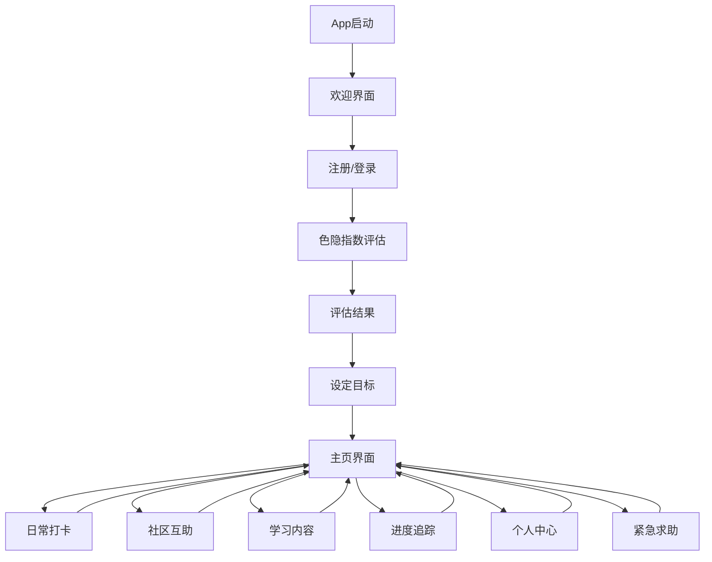

## 3. 详细用户流程

### 3.1 新用户注册流程

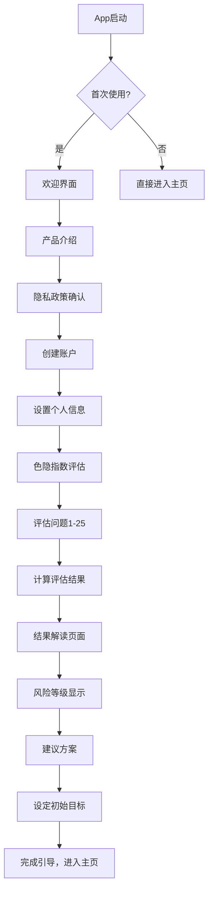

### 3.2 日常使用主流程

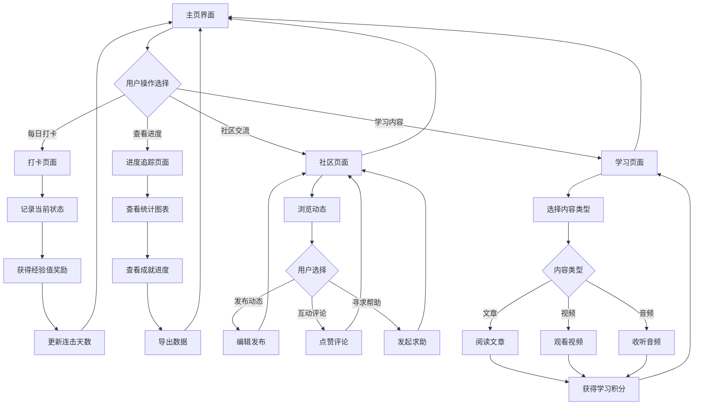

### 3.3 紧急求助流程

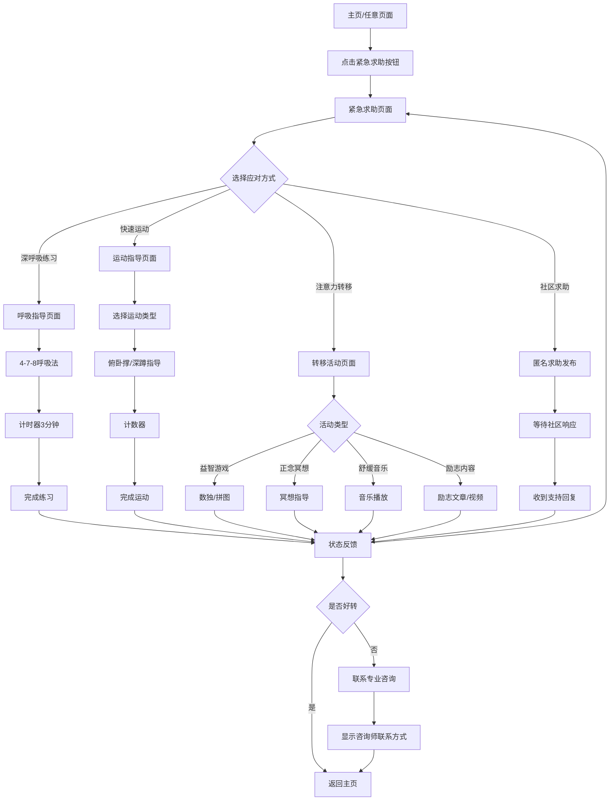

### 3.4 社区互动流程

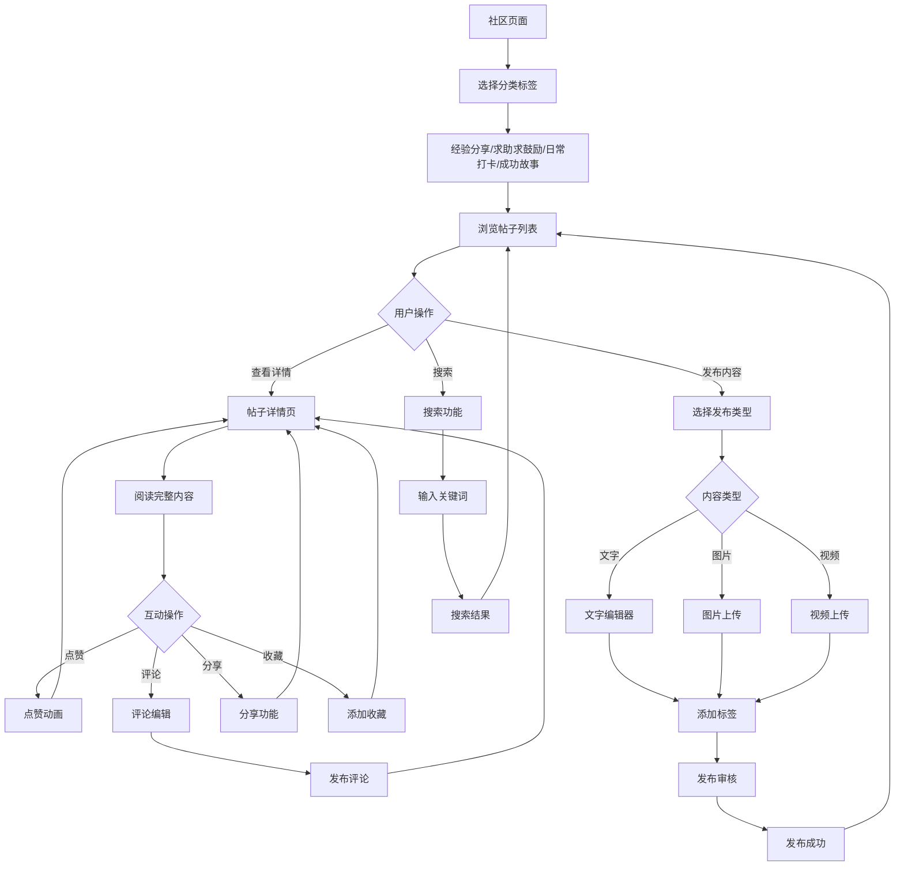

### 3.5 个人中心管理流程

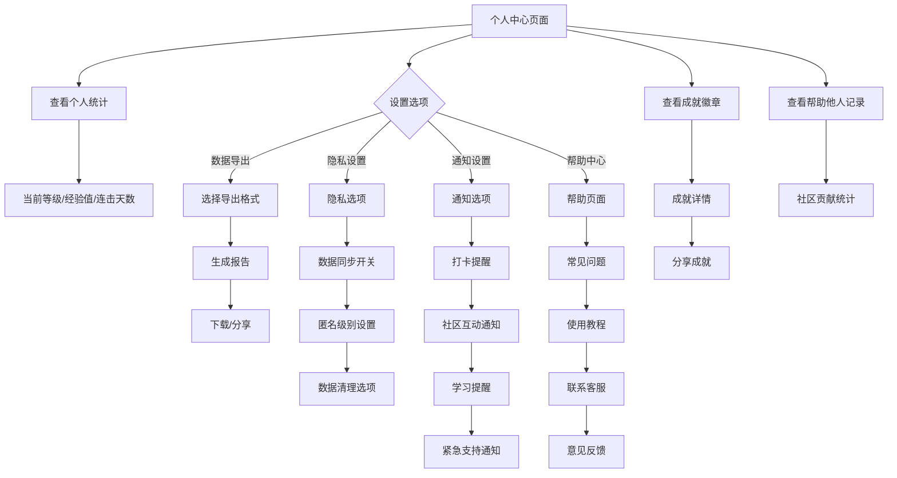

## 4. 页面间导航关系

### 4.1 底部导航栏页面关系

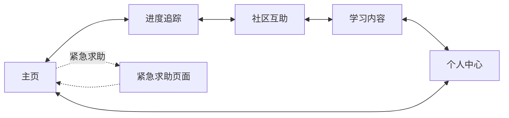

### 4.2 主页快捷入口关系

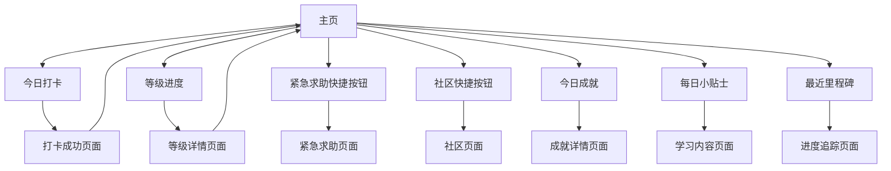

## 5. 用户状态流转

### 5.1 用户等级状态流转

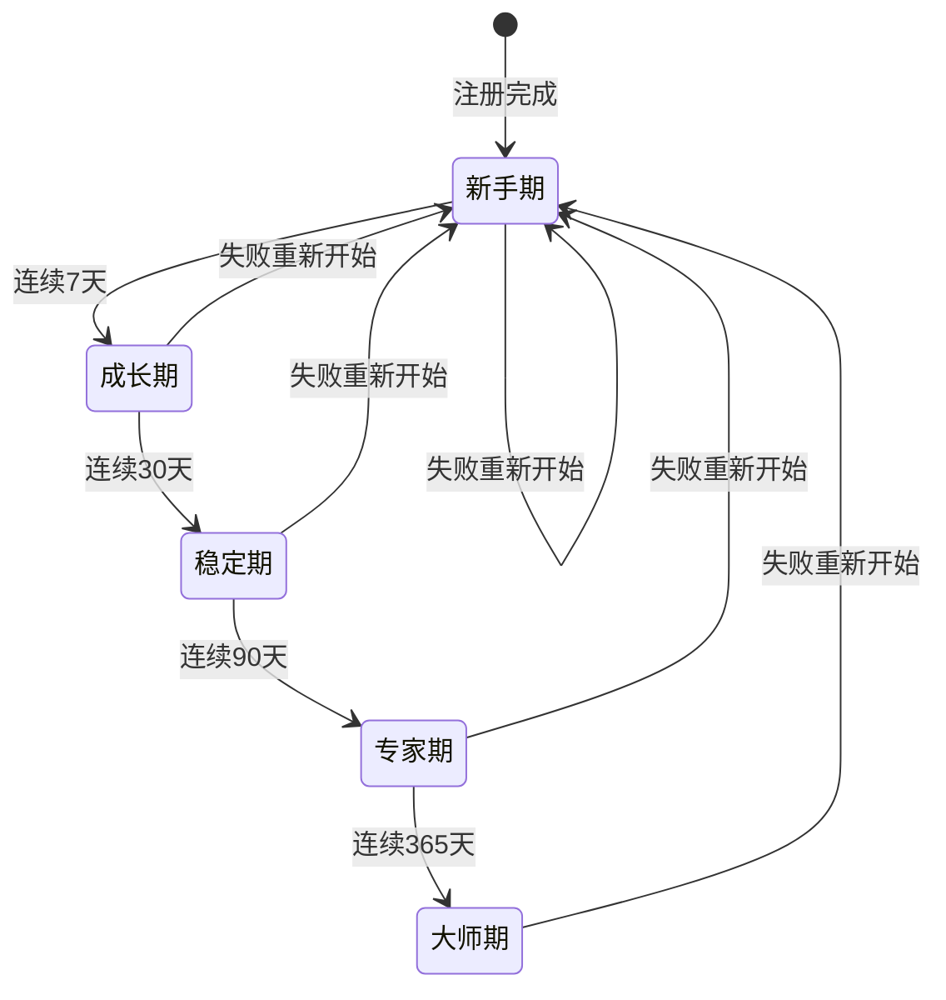

### 5.2 应用使用状态流转

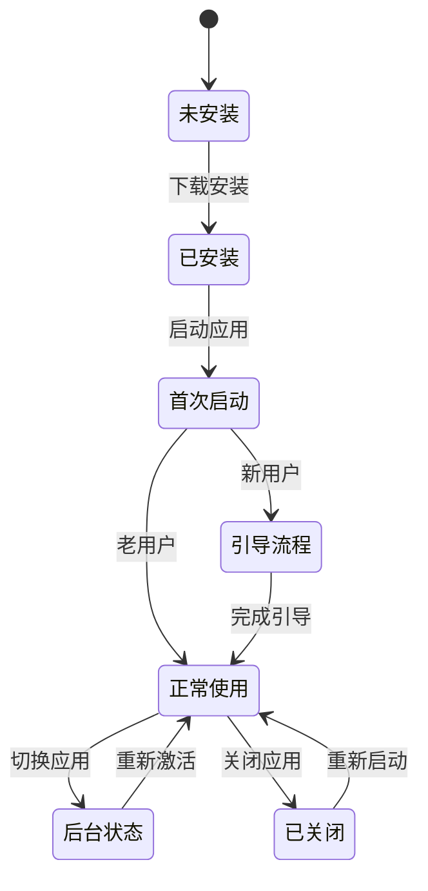

## 6. 异常情况处理流程

### 6.1 网络异常处理

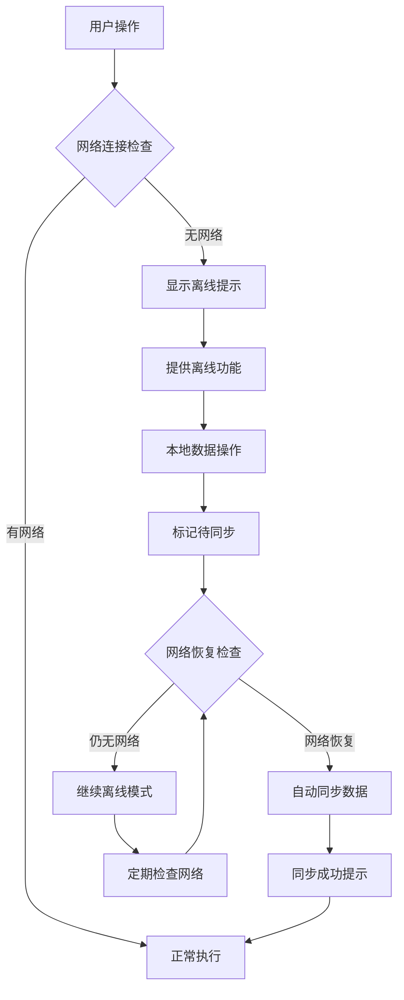

### 6.2 数据同步失败处理

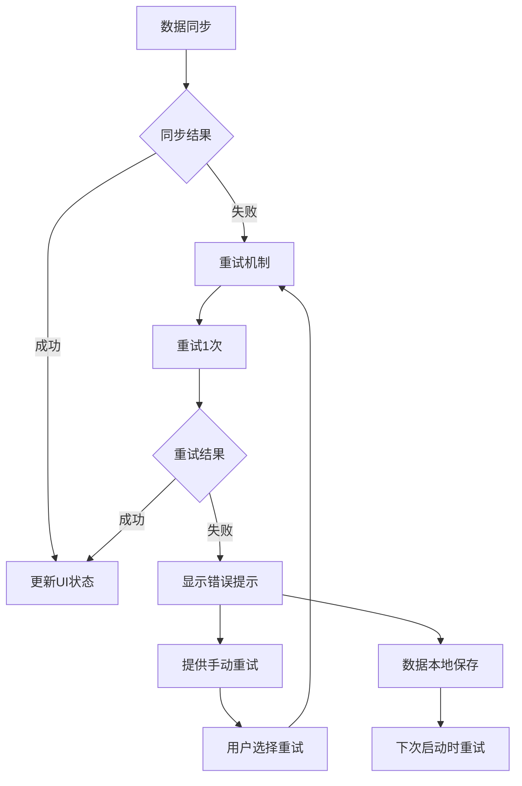

## 7. 关键路径分析

### 7.1 新用户核心路径 (Critical Path)
1. **App下载安装** → **首次启动** → **欢迎引导** → **注册账户**
2. **色隐指数评估** → **查看结果** → **设定目标** → **进入主页**
3. **首次打卡** → **获得奖励** → **了解游戏化机制** → **形成使用习惯**

**关键成功指标**:
- 完成引导流程的用户比例 > 80%
- 首周打卡次数 > 5次
- 首月留存率 > 60%

### 7.2 日常用户核心路径
1. **打开App** → **查看主页** → **日常打卡** → **查看奖励**
2. **浏览社区** → **互动交流** → **获得支持** → **增强动力**
3. **学习内容** → **获得知识** → **应用实践** → **提升成功率**

**关键成功指标**:
- 日均使用频次 > 3次
- 社区参与率 > 40%
- 月度成功率 > 70%

### 7.3 危机干预路径 (Emergency Path)
1. **面临诱惑** → **点击紧急求助** → **选择应对方式** → **执行干预**
2. **完成干预** → **状态评估** → **效果反馈** → **记录经验**

**关键成功指标**:
- 紧急求助响应时间 < 3秒
- 干预有效率 > 75%
- 求助后24小时内成功率 > 80%

## 8. 流程优化建议

### 8.1 减少操作步骤
- **一键打卡**: 主页突出打卡按钮，减少进入打卡页面的步骤
- **快速访问**: 重要功能提供快捷入口，避免深层导航
- **智能默认**: 根据用户习惯预设选项，减少重复操作

### 8.2 增强用户引导
- **渐进式引导**: 分阶段介绍功能，避免信息过载
- **上下文帮助**: 在关键操作点提供即时帮助提示
- **操作反馈**: 每个操作都有明确的视觉或触觉反馈

### 8.3 提升流程连贯性
- **状态保持**: 用户在不同页面间切换时保持操作状态
- **数据连续**: 确保用户数据在各个流程中的一致性
- **体验衔接**: 页面间转换自然流畅，避免突兀的跳转

---

**文档版本**: v1.0  
**最后更新**: 2024-01-15  
**维护者**: UI/UX 设计团队  

此流程图文档定义了"戒色助手"应用的核心用户操作路径，为产品开发和优化提供重要参考。所有功能实现都应遵循这些流程设计，确保用户体验的连贯性和有效性。 