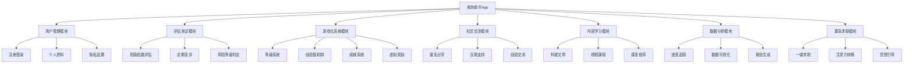
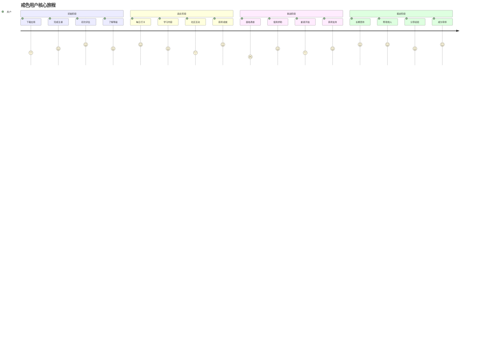
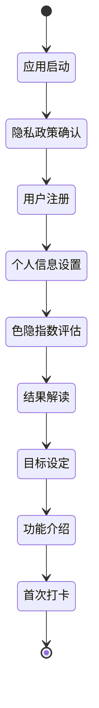
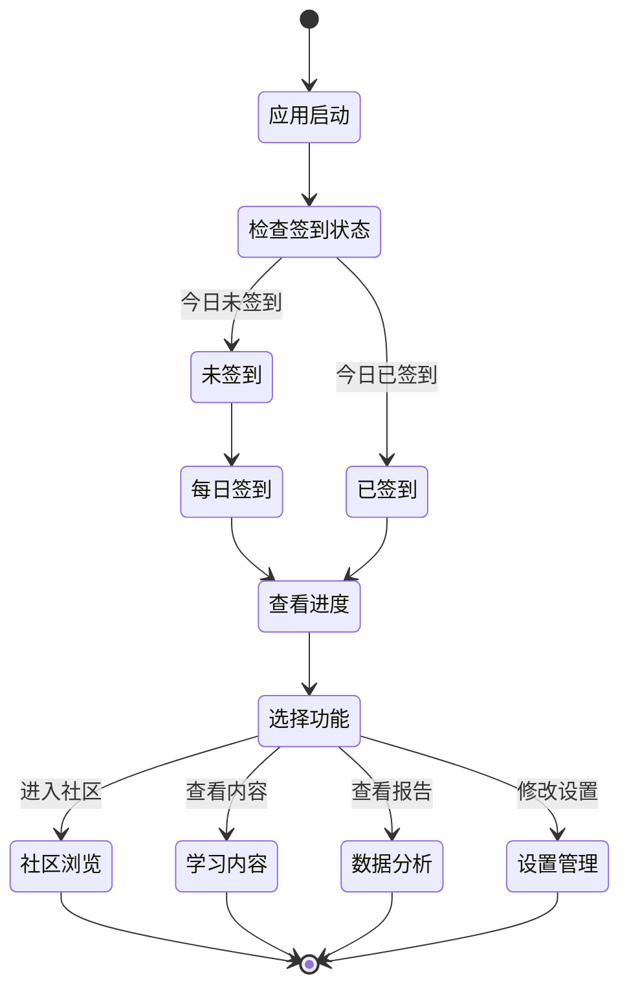

# 戒色助手 App 产品需求文档 (PRD)

## 1. 文档信息

### 1.1 版本历史
| 版本 | 日期 | 修改人 | 修改内容 |
|------|------|--------|----------|
| v1.0 | 2024-01-15 | 产品经理 | 初版PRD创建 |

### 1.2 文档目的
本文档旨在详细描述戒色助手App的产品需求，为设计、开发、测试团队提供清晰的产品规格说明和功能指导。

### 1.3 相关文档引用
- 产品路线图 (Roadmap.md)
- 用户故事地图 (User_Story_Map.md)
- 产品评估指标框架 (Metrics_Framework.md)

## 2. 产品概述

### 2.1 产品名称与定位
- **产品名称**: 戒色助手 (NoFap Helper)
- **产品定位**: 专注于帮助年轻人戒除色情内容依赖的游戏化健康管理应用
- **产品类型**: 个人健康管理 + 游戏化激励应用

### 2.2 产品愿景与使命
- **愿景**: 成为最有效的戒色辅助工具，帮助用户重获健康生活方式
- **使命**: 通过科学的评估体系和游戏化机制，帮助用户建立自控力，摆脱色情内容依赖

### 2.3 价值主张与独特卖点(USP)
- **核心价值**: 将戒色过程游戏化，通过"升级打怪"机制增强用户动力
- **独特卖点**:
  - 科学的色隐指数评估系统
  - 游戏化的成长和奖励机制
  - 个性化的康复计划制定
  - 社区支持和匿名分享功能

### 2.4 目标平台列表
- iOS (iPhone)
- Android
- Web 应用 (PWA)
- 微信小程序

### 2.5 产品核心假设
- 用户对戒色有强烈需求但缺乏有效工具
- 游戏化机制能显著提升用户坚持度
- 科学的评估体系能帮助用户认知问题严重性
- 社区支持对戒色成功有重要作用

### 2.6 商业模式概述
- **免费模式**: 基础功能免费使用
- **会员订阅**: 高级功能和个性化服务
- **内容付费**: 专业课程和指导内容

## 3. 用户研究

### 3.1 目标用户画像

#### 3.1.1 人口统计特征
- **年龄段**: 18-35岁
- **性别**: 主要为男性用户(90%+)
- **教育背景**: 高中及以上学历
- **职业分布**: 学生、程序员、白领职员
- **收入水平**: 中等收入群体

#### 3.1.2 行为习惯与偏好
- 重度互联网使用者，日均上网时间6-10小时
- 习惯在夜间使用手机和电脑
- 对游戏化产品有较高接受度
- 注重隐私保护，偏好匿名使用
- 喜欢数据化的进度反馈

#### 3.1.3 核心需求与痛点
**核心需求**:
- 戒除色情内容依赖的强烈愿望
- 需要科学的方法和工具支持
- 希望获得进度反馈和成就感
- 需要社区支持和鼓励

**主要痛点**:
- 缺乏有效的戒色方法和工具
- 容易反复，缺乏持续动力
- 对自己的依赖程度缺乏客观认知
- 羞耻感强，不愿寻求现实帮助
- 传统戒色方法枯燥乏味

#### 3.1.4 动机与目标
- 提升生活质量和精神状态
- 改善人际关系和工作效率
- 重建健康的性观念
- 培养更好的自控能力

### 3.2 用户场景分析

#### 3.2.1 核心使用场景详述
**场景1：初次评估**
- 用户首次下载App，进行色隐指数评估
- 了解自己的依赖程度和风险级别
- 制定个性化的戒色计划

**场景2：日常打卡**
- 用户每日进行戒色状态打卡
- 记录当天的状态和感受
- 获得经验值和成就奖励

**场景3：危机时刻**
- 用户面临诱惑，需要紧急支持
- 使用紧急求助功能
- 获得即时的鼓励和转移注意力的活动建议

#### 3.2.2 边缘使用场景考量
- 多设备同步使用
- 离线状态下的基础功能
- 数据导出和备份需求

## 4. 市场与竞品分析

### 4.1 市场规模与增长预测
- 全球戒色相关App市场规模约5000万美元，年增长率15%
- 中国市场潜在用户规模约2000万人
- 移动健康管理市场持续增长，为产品提供良好环境

### 4.2 行业趋势分析
- 数字健康管理成为主流趋势
- 游戏化在健康类App中应用越来越广泛
- 用户对心理健康和自我管理的重视度提升
- AI和个性化推荐技术在健康管理中的应用增加

### 4.3 竞争格局分析

#### 4.3.1 直接竞争对手详析
**NoFap Tracker**
- 优势：简单易用，社区活跃
- 劣势：功能单一，缺乏游戏化元素
- 定价：免费 + $2.99高级版

**Fortify**
- 优势：专业性强，有科学依据
- 劣势：界面较为严肃，用户粘性一般
- 定价：$9.99/月

#### 4.3.2 间接竞争对手概述
- 习惯养成类App (Habitica, Streaks)
- 自控力培养App (Freedom, Cold Turkey)
- 心理健康App (Headspace, Calm)

### 4.4 竞品功能对比矩阵

| 功能 | 戒色助手 | NoFap Tracker | Fortify | Habitica |
|------|----------|---------------|---------|----------|
| 依赖程度评估 | ✅ 科学量表 | ❌ | ✅ 基础评估 | ❌ |
| 游戏化机制 | ✅ 完整RPG | ❌ | ❌ | ✅ 简单游戏 |
| 社区功能 | ✅ 匿名社区 | ✅ 论坛 | ✅ 基础社区 | ✅ 队伍系统 |
| 个性化计划 | ✅ AI推荐 | ❌ | ✅ 基础计划 | ❌ |
| 紧急求助 | ✅ 完整功能 | ✅ 基础功能 | ✅ 基础功能 | ❌ |
| 数据分析 | ✅ 详细报告 | ✅ 基础统计 | ✅ 进度追踪 | ✅ 统计图表 |

### 4.5 市场差异化策略
- 构建最完整的色隐指数评估体系
- 打造最具吸引力的游戏化戒色体验
- 提供最专业的心理健康内容支持
- 建立最温暖的戒色者社区环境

## 5. 产品功能需求

### 5.1 功能架构与模块划分

### 5.2 核心功能详述

#### 5.2.1 色隐指数评估系统

**功能描述**: 
作为一名希望戒色的用户，我想要了解自己的色情内容依赖程度，以便制定合适的康复计划。

**用户价值**: 
- 提供客观的自我认知工具
- 科学评估依赖程度和风险级别
- 为个性化治疗方案提供数据基础

**功能逻辑与规则**:
- 基于国际认可的性成瘾评估量表(SAST-R, PATHOS)设计
- 包含50个科学问题，涵盖行为频率、影响程度、控制能力等维度
- 评估结果分为5个等级：正常(0-20分)、轻度(21-40分)、中度(41-60分)、重度(61-80分)、虽重(81-100分)
- 每3个月自动提醒用户进行复评
- 评估过程支持暂停和继续，保护用户隐私

**交互要求**:
- 问题采用滑块或选择题形式，降低回答压力
- 每完成10题显示进度条，增强完成动力
- 结果页面使用友好的颜色和图表展示
- 提供详细的结果解读和建议

**数据需求**:
- 问题库：存储评估问题和选项
- 分值规则：各选项对应的分值
- 用户答案：记录用户每次评估的回答
- 评估历史：追踪用户的评估变化趋势

**技术依赖**:
- 本地数据加密存储
- 离线评估支持
- 云端数据同步(可选)

**验收标准**:
- 用户能在15分钟内完成完整评估
- 评估结果准确率达到95%以上
- 评估过程中断后能准确恢复进度
- 结果展示清晰易懂，用户理解度达到90%

#### 5.2.2 游戏化升级系统

**功能描述**:
作为一名戒色用户，我想要通过游戏化的方式记录戒色进度，以便获得成就感和持续动力。

**用户价值**:
- 将枯燥的戒色过程变得有趣
- 提供持续的激励和成就感
- 建立长期坚持的习惯循环

**功能逻辑与规则**:
- **等级系统**: 共设置50个等级，每个等级对应不同的戒色天数里程碑
  - 1-7天：新手期(1-5级)
  - 8-30天：成长期(6-15级)
  - 31-90天：稳定期(16-25级)
  - 91-365天：专家期(26-40级)
  - 365天+：大师期(41-50级)
- **经验值机制**:
  - 每日签到：+10经验值
  - 连续签到奖励：7天+50，30天+200，90天+500
  - 完成日常任务：+20-50经验值
  - 社区贡献：+10-30经验值
  - 学习内容：+15经验值
- **成就系统**: 设计100+个成就徽章，包括时间类、行为类、社区类
- **虚拟奖励**: 解锁主题皮肤、专属头像、个性化称号
- **失败处理**: 重来不清零，保留80%经验值，鼓励再次尝试

**交互要求**:
- 升级时播放庆祝动效和音效
- 经验值变化有明显的视觉反馈
- 成就获得时弹出精美的成就卡片
- 等级进度条实时显示当前进度

**数据需求**:
- 用户等级和经验值
- 成就获得记录
- 连续天数统计
- 任务完成记录

**技术依赖**:
- 本地计时器和推送通知
- 动画效果库
- 音效资源

**验收标准**:
- 经验值计算100%准确
- 升级触发及时，延迟<1秒
- 成就解锁逻辑正确率100%
- 用户对游戏化元素满意度>85%

#### 5.2.3 社区互助功能

**功能描述**:
作为戒色用户，我想要在匿名的环境中与其他戒色者交流经验，以便获得情感支持和实用建议。

**用户价值**:
- 获得来自同伴的理解和支持
- 学习他人的成功经验和方法
- 减少孤独感和挫败感
- 通过帮助他人获得成就感

**功能逻辑与规则**:
- **匿名机制**: 用户使用虚拟昵称和头像，无需暴露真实身份
- **内容分类**: 
  - 经验分享
  - 求助求鼓励
  - 日常打卡
  - 学习讨论
- **互动方式**: 点赞、评论、私聊、举报
- **等级权限**: 不同等级用户有不同的发帖和评论权限
- **内容审核**: AI预审核 + 人工复审，确保内容健康积极
- **激励机制**: 优质内容获得更多曝光和奖励

**交互要求**:
- 简洁明了的信息流界面
- 快速发布和回复功能
- 丰富的表情和贴纸支持
- 内容举报和屏蔽功能

**数据需求**:
- 用户发帖和评论记录
- 点赞和互动数据
- 内容审核记录
- 用户举报记录

**技术依赖**:
- 实时消息推送
- 内容审核API
- 图片上传和处理

**验收标准**:
- 内容发布成功率>99%
- 消息推送及时性<5秒
- 有害内容拦截率>95%
- 用户社区活跃度>60%

#### 5.2.4 紧急求助功能

**功能描述**:
作为面临诱惑的戒色用户，我需要快速获得支持和帮助，以便度过危险时刻。

**用户价值**:
- 在关键时刻提供即时支持
- 有效转移注意力，避免破戒
- 提供多种应对策略和工具

**功能逻辑与规则**:
- **一键求助**: 大红按钮，点击后立即激活所有求助机制
- **注意力转移活动**:
  - 呼吸冥想练习（3-10分钟）
  - 快速运动指导（俯卧撑、深蹲）
  - 益智小游戏（数独、拼图）
  - 正能量视频播放
- **社区紧急支持**: 向在线的高级用户发送匿名求助请求
- **专业资源**: 提供专业心理咨询师的联系方式
- **冷静倒计时**: 强制等待5-10分钟的冷静期设计

**交互要求**:
- 紧急按钮醒目易见
- 快速响应，无需复杂操作
- 全屏沉浸式体验
- 柔和的配色降低焦虑

**数据需求**:
- 求助记录和时间
- 使用的应对策略
- 求助效果反馈
- 在线志愿者状态

**技术依赖**:
- 音频播放和录制
- 视频流媒体
- 实时通信功能
- 传感器调用（心率检测）

**验收标准**:
- 求助响应时间<3秒
- 冥想和运动指导完成率>70%
- 社区响应率>50%
- 紧急求助有效率>80%

#### 5.2.5 数据分析与报告

**功能描述**:
作为戒色用户，我想要了解自己的进步情况和变化趋势，以便调整戒色策略。

**用户价值**:
- 直观了解自己的进步
- 发现问题和改进空间
- 增强戒色信心和动力

**功能逻辑与规则**:
- **进度追踪**: 连续天数、总戒色天数、成功率统计
- **情绪分析**: 每日情绪评分的趋势变化
- **行为分析**: 破戒时间点、触发因素统计
- **成长报告**: 周报、月报、年度报告自动生成
- **对比分析**: 与同等级用户的匿名对比
- **预测模型**: 基于历史数据预测风险时期

**交互要求**:
- 丰富的图表和可视化展示
- 支持多时间维度查看
- 报告分享和导出功能
- 个性化的数据洞察提示

**数据需求**:
- 用户行为日志
- 情绪和状态记录
- 环境和触发因素数据
- 成功和失败事件记录

**技术依赖**:
- 数据可视化图表库
- 机器学习分析模型
- 数据导出功能

**验收标准**:
- 数据统计准确率100%
- 图表加载时间<2秒
- 报告生成成功率>98%
- 用户对数据洞察有用性评价>80%

### 5.3 次要功能描述

#### 5.3.1 学习内容模块
- 科普文章：性教育、心理健康知识
- 视频课程：专家讲座、康复指导
- 音频内容：冥想指导、正念练习
- 读书推荐：相关书籍和资源

#### 5.3.2 个人设置
- 隐私设置：数据同步、匿名级别
- 通知设置：提醒频率、时间设定
- 界面设置：主题切换、字体大小
- 账户管理：密码修改、数据导出

#### 5.3.3 工具集合
- 网站屏蔽器：集成内容过滤功能
- 时间管理：番茄钟、专注模式
- 健康追踪：运动记录、睡眠质量
- 目标设定：短期和长期目标管理

### 5.4 未来功能储备 (Backlog)
- AI个性化助手和智能对话
- VR冥想和放松体验
- 生物反馈监测集成
- 专业咨询师在线服务
- 家庭监护和支持功能
- 康复成功后的维护模式

## 6. 用户流程与交互设计指导

### 6.1 核心用户旅程地图

### 6.2 关键流程详述与状态转换图

**新用户引导流程**:

**日常使用流程**:

### 6.3 对设计师 (UI/UX Agent) 的界面原型参考说明和要求

#### 整体设计原则
- **温暖友好**: 使用温暖的色彩搭配，避免冷酷感
- **私密安全**: 界面设计体现隐私保护，降低用户心理压力
- **游戏化视觉**: 加入游戏元素，但保持专业性
- **简洁明了**: 信息层次清晰，操作路径简单

#### 关键页面设计要求

**主页设计**:
- 突出当前戒色天数和等级信息
- 显著的签到按钮设计
- 快速访问紧急求助功能
- 清晰的进度条展示

**评估页面**:
- 问题展示要舒缓，避免压迫感
- 进度指示明确
- 支持随时暂停和返回
- 结果页面要积极正面

**社区页面**:
- 信息流设计简洁
- 匿名身份标识清晰
- 内容分类导航明显
- 互动按钮易于点击

**紧急求助页面**:
- 大按钮设计，方便紧急操作
- 冷静的色彩搭配
- 快速访问各种工具
- 沉浸式体验设计

#### 视觉元素要求
- 主色调：温暖的蓝绿色
- 辅助色：清新的绿色、温柔的橙色
- 背景色：浅灰白色，护眼舒适
- 强调色：活力红色（仅用于紧急按钮）
- 图标风格：简洁线条，统一风格
- 字体：易读性强，支持多种字重

### 6.4 交互设计规范与原则建议

#### 核心交互原则
- **即时反馈**: 所有用户操作都要有明确的视觉或触觉反馈
- **容错性**: 重要操作需要二次确认，支持撤销
- **一致性**: 相同功能在不同页面保持一致的交互方式
- **可访问性**: 考虑视力障碍用户，提供语音和震动反馈

#### 手势和交互规范
- **签到**: 长按签到按钮3秒，增加仪式感
- **紧急求助**: 双击或长按激活，防止误触
- **社区互动**: 支持滑动手势进行快速操作
- **数据查看**: 支持手势缩放和滑动切换时间段

## 7. 非功能需求

### 7.1 性能需求

#### 响应时间要求
- 应用启动时间 ≤ 3秒
- 页面切换响应时间 ≤ 1秒
- 数据加载显示时间 ≤ 2秒
- 紧急功能响应时间 ≤ 0.5秒
- 社区内容刷新时间 ≤ 1.5秒

#### 并发性能
- 支持同时在线用户数：10,000+
- 社区消息并发处理：1,000条/分钟
- 数据库查询响应时间：平均 < 100ms
- 系统可用性：99.9%（年停机时间 < 8.76小时）

#### 资源使用要求
- 应用安装包大小 ≤ 150MB
- 运行时内存占用 ≤ 200MB
- CPU使用率：正常使用 < 15%，高峰 < 30%
- 电池消耗：后台模式 < 5%/天
- 网络流量：日常使用 < 50MB/天

### 7.2 安全需求

#### 数据加密
- 用户密码：采用bcrypt加密存储
- 敏感数据传输：TLS 1.3加密
- 本地数据存储：AES-256加密
- API通信：HTTPS + Token认证

#### 认证授权
- 用户身份认证：多因子认证支持
- 会话管理：JWT Token，有效期24小时
- 权限控制：基于角色的访问控制(RBAC)
- 敏感操作：需要重新验证身份

#### 隐私保护
- 数据匿名化：个人标识信息加密处理
- 数据最小化：只收集必要的用户数据
- 用户控制：用户可随时删除个人数据
- 透明度：清晰的隐私政策和数据使用说明

#### 安全防护
- SQL注入防护：参数化查询、输入验证
- XSS防护：输出编码、CSP策略
- CSRF防护：Token验证机制
- DDoS防护：流量限制、IP黑名单
- 数据备份：每日自动备份，异地存储

### 7.3 可用性与可访问性标准

#### 可用性要求
- 用户完成核心任务的成功率 ≥ 95%
- 新用户完成注册流程的完成率 ≥ 85%
- 用户满意度评分 ≥ 4.5/5.0
- 界面学习时间：新用户 ≤ 5分钟掌握基本操作

#### 可访问性标准
- 遵循WCAG 2.1 AA级标准
- 支持屏幕阅读器
- 提供高对比度主题
- 支持字体大小调整（100%-200%）
- 颜色信息不作为唯一的信息传达方式
- 所有功能支持键盘操作

### 7.4 合规性要求

#### 数据保护法规
- **GDPR合规**：
  - 数据处理有明确的法律依据
  - 提供数据可携带权
  - 支持被遗忘权（数据删除）
  - 72小时内报告数据泄露
- **中国网络安全法**：
  - 数据本地化存储
  - 实名制认证机制
  - 内容审核机制

#### 应用商店合规
- Apple App Store审核指南
- Google Play政策
- 中国各大应用商店要求
- 内容分级：适用于17岁以上用户

#### 医疗健康相关
- 不提供医疗诊断和治疗建议
- 明确标注非医疗专业工具
- 建议用户咨询专业医生

### 7.5 数据统计与分析需求

#### 核心埋点事件
- **用户行为类**：
  - 应用启动、关闭
  - 签到成功、失败
  - 功能模块访问
  - 社区互动行为
- **业务指标类**：
  - 戒色成功率
  - 用户留存率
  - 功能使用频率
  - 紧急求助使用情况
- **性能类**：
  - 页面加载时间
  - 接口响应时间
  - 崩溃和错误率
  - 电池和内存使用

#### 数据分析平台
- 集成Firebase Analytics
- 自建数据仓库和BI系统
- 实时监控Dashboard
- 用户行为漏斗分析

## 8. 技术架构考量

### 8.1 技术栈建议

#### 移动端开发
- **跨平台方案**：Flutter（优先考虑）
  - 原因：统一代码库，开发效率高，性能接近原生
  - 替代方案：React Native或原生开发
- **状态管理**：Provider + ChangeNotifier
- **本地存储**：SQLite + Hive
- **网络请求**：Dio + JSON序列化

#### 后端技术栈
- **主要语言**：Go（高并发性能）或Node.js（开发效率）
- **Web框架**：Gin (Go) 或 Express (Node.js)
- **数据库**：PostgreSQL（主库）+ Redis（缓存）
- **消息队列**：RabbitMQ或Apache Kafka
- **搜索引擎**：Elasticsearch（社区内容搜索）

#### 基础设施
- **云服务**：阿里云或腾讯云
- **容器化**：Docker + Kubernetes
- **CI/CD**：GitLab CI或GitHub Actions
- **监控**：Prometheus + Grafana

### 8.2 系统集成需求

#### 第三方服务集成
- **推送服务**：极光推送或Firebase Cloud Messaging
- **内容审核**：腾讯云内容安全或阿里云内容检测
- **视频服务**：七牛云或阿里云视频点播
- **地图服务**：高德地图API（如需要位置功能）
- **支付服务**：微信支付、支付宝（如有付费功能）

#### API设计要求
- RESTful API设计规范
- API版本控制策略
- 统一的错误码和返回格式
- 接口限流和防刷机制
- 完善的API文档（Swagger）

### 8.3 技术依赖与约束

#### 开发环境要求
- 最低Android版本：Android 6.0 (API 23)
- 最低iOS版本：iOS 12.0
- 开发工具：Android Studio、Xcode、VS Code
- Flutter SDK版本：3.0+

#### 性能约束
- 应用包体积限制：iOS < 150MB，Android < 200MB
- 内存使用限制：< 200MB运行时内存
- 网络请求超时：15秒
- 图片大小限制：单张 < 5MB

### 8.4 数据模型建议

#### 核心实体设计

**用户实体 (User)**:
- id: 主键
- username: 用户名（可选）
- email: 邮箱
- phone: 手机号
- avatar_url: 头像URL
- privacy_level: 隐私级别
- created_at/updated_at: 时间戳

**戒色记录实体 (Abstinence_Record)**:
- id: 主键
- user_id: 用户ID
- start_date: 开始日期
- current_streak: 当前连续天数
- longest_streak: 最长连续天数
- total_attempts: 总尝试次数
- level: 当前等级
- experience_points: 经验值

**评估结果实体 (Assessment_Result)**:
- id: 主键
- user_id: 用户ID
- addiction_score: 色隐指数
- assessment_date: 评估日期
- detailed_scores: 详细评分（JSON）
- risk_level: 风险等级

**社区动态实体 (Community_Post)**:
- id: 主键
- user_id: 用户ID
- content: 内容
- category: 分类
- images: 图片URLs（JSON数组）
- like_count: 点赞数
- comment_count: 评论数
- status: 审核状态
- created_at: 发布时间

#### 关系设计
- 用户与戒色记录：一对多关系
- 用户与评估结果：一对多关系
- 用户与社区动态：一对多关系
- 动态与评论：一对多关系
- 用户与成就：多对多关系

## 9. 验收标准汇总

### 9.1 功能验收标准矩阵

| 功能模块 | 核心指标 | 验收标准 | 测试方法 |
|---------|---------|----------|----------|
| 色隐指数评估 | 评估准确性 | 结果可信度>90% | 专家评审+用户反馈 |
| 游戏化等级系统 | 数据准确性 | 计算正确率100% | 自动化测试 |
| 社区功能 | 内容安全 | 有害内容拦截率>95% | 内容审核测试 |
| 紧急求助 | 响应速度 | 响应时间<3秒 | 性能测试 |
| 数据分析 | 数据准确性 | 统计准确率100% | 数据验证测试 |

### 9.2 性能验收标准

| 性能指标 | 标准 | 测试条件 |
|---------|------|----------|
| 应用启动时间 | ≤3秒 | 冷启动测试 |
| 页面切换 | ≤1秒 | 各功能模块间切换 |
| 内存占用 | ≤200MB | 长时间使用测试 |
| 电池消耗 | <5%/天 | 后台运行测试 |
| 网络流量 | <50MB/天 | 日常使用模拟 |

### 9.3 质量验收标准

#### Bug密度要求
- 严重Bug密度：0个/千行代码
- 一般Bug密度：<2个/千行代码
- 轻微Bug密度：<5个/千行代码

#### 代码质量要求
- 代码覆盖率：核心功能>90%，整体>80%
- 构建成功率：>99%
- 安全扫描：无高危漏洞
- 性能测试：通过率100%

## 10. 产品成功指标

### 10.1 关键绩效指标 (KPIs) 定义与目标

#### 用户增长指标
- **日活跃用户数 (DAU)**：目标 1万+ (6个月内)
- **月活跃用户数 (MAU)**：目标 5万+ (6个月内)
- **用户留存率**：
  - 次日留存率：>70%
  - 7日留存率：>45%
  - 30日留存率：>25%

#### 核心业务指标
- **用户戒色成功率**：30天成功率>60%，90天成功率>35%
- **平均戒色天数**：所有用户平均连续天数>15天
- **社区活跃度**：每日发帖量>500条，用户参与率>40%
- **紧急求助有效性**：求助后24小时内不破戒率>75%

#### 产品粘性指标
- **平均会话时长**：>8分钟/次
- **平均日使用频次**：>3次/天
- **功能使用深度**：80%用户使用3个以上核心功能
- **社区贡献率**：20%的活跃用户有内容产出

#### 商业化指标（未来考虑）
- **付费转化率**：>5%（如推出付费功能）
- **ARPU值**：>50元/月/付费用户
- **用户获客成本 (CAC)**：<100元/用户
- **用户生命周期价值 (LTV)**：>300元/用户

### 10.2 北极星指标定义与选择依据

#### 北极星指标
**用户累计戒色天数总和**

#### 选择依据
1. **直接反映产品价值**：累计戒色天数直接体现了产品帮助用户实现戒色目标的核心价值
2. **可量化且有意义**：数据易于统计，且数字增长代表着真实的用户获益
3. **驱动业务增长**：该指标的提升需要同时关注用户新增、留存和成功率
4. **符合长期愿景**：与产品"帮助用户获得更健康生活"的使命高度一致

#### 分解指标
- 活跃用户数量 × 平均戒色成功天数
- 新用户获取 × 用户留存率 × 戒色成功率 × 平均戒色周期

### 10.3 指标监测计划

#### 实时监控指标（每日）
- DAU、新增用户数
- 签到完成率、社区内容发布量
- 应用崩溃率、关键接口响应时间
- 紧急求助使用次数和成功率

#### 定期分析指标（每周）
- 用户留存率变化趋势
- 各功能模块使用情况
- 用户反馈和满意度
- 戒色成功率统计

#### 深度分析指标（每月）
- 用户行为漏斗分析
- 北极星指标进展情况
- 竞品对比分析
- ROI和商业化相关指标

#### 年度回顾指标
- 产品整体成功率评估
- 用户长期价值分析
- 市场占有率和品牌影响力
- 技术债务和产品健康度

#### 监测工具和平台
- **数据采集**：Firebase Analytics、自建埋点系统
- **数据分析**：Google Analytics、Mixpanel、自建BI系统
- **实时监控**：Grafana Dashboard、PagerDuty告警
- **用户反馈**：应用内反馈系统、应用商店评价监控

---

## 附录

### A. 词汇表

- **色隐指数**: Pornography Addiction Index，评估用户色情内容依赖程度的量化指标
- **戒色**: 戒除对色情内容的依赖，培养健康的生活方式
- **破戒**: 用户重新接触色情内容，中断戒色进程
- **等级系统**: 基于用户戒色天数和活跃度的游戏化等级划分
- **北极星指标**: 最能体现产品核心价值的关键指标
- **HEART框架**: Google的用户体验指标框架（Happiness, Engagement, Adoption, Retention, Task success）

### B. 参考资料

1. 《网络色情成瘾的心理机制研究》- 中科院心理研究所
2. 《数字化戒瘾产品设计指南》- Stanford Digital Health Lab
3. 《游戏化产品设计最佳实践》- Nir Eyal
4. 《移动应用隐私保护技术规范》- 工信部
5. WHO《性成瘾障碍诊断标准》

### C. 文档变更记录

| 版本 | 日期 | 变更内容 | 修改人 |
|------|------|----------|--------|
| 1.0 | 2024-01-XX | 初版PRD文档创建 | 产品经理 |
| 1.1 | 2024-01-XX | 补充技术架构和安全需求 | 产品经理 |
| 1.2 | 2024-01-XX | 完善验收标准和成功指标 | 产品经理 |

---

**文档结束**

本产品需求文档为"戒色助手"移动应用的完整需求规格说明。文档涵盖了从产品概念到技术实现的全方位要求，为后续的设计、开发、测试工作提供了详细的指导方针。

所有相关团队成员应仔细阅读并理解本文档内容，在执行过程中如有疑问或需要调整，应及时与产品团队沟通确认。