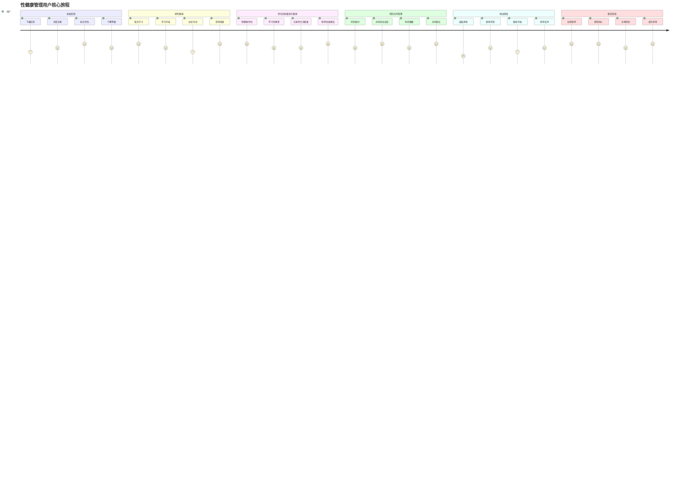
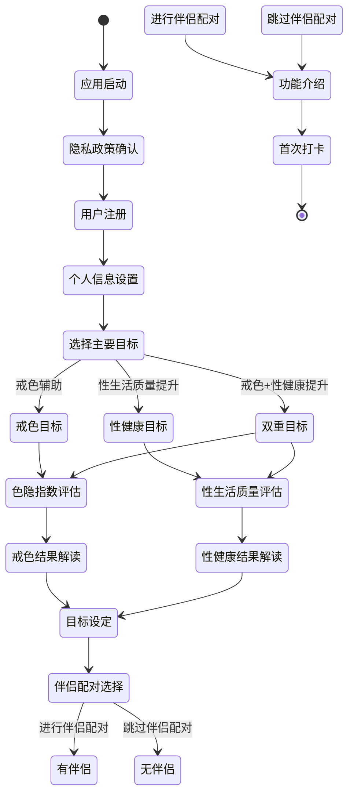
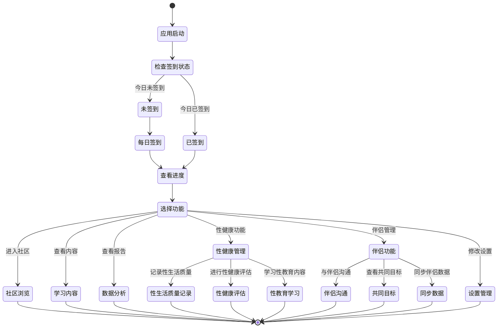

# 性健康管理助手 App 产品需求文档 (PRD)

## 1. 文档信息

### 1.1 版本历史
| 版本 | 日期 | 修改人 | 修改内容 |
|------|------|--------|----------|
| v1.0 | 2024-01-15 | 产品经理 | 初版PRD创建 |
| v2.0 | 2024-01-XX | 产品经理 | 扩展为性健康管理平台，增加性生活质量提升功能 |

### 1.2 文档目的
本文档旨在详细描述性健康管理助手App的产品需求，为设计、开发、测试团队提供清晰的产品规格说明和功能指导。

### 1.3 相关文档引用
- 产品路线图 (Roadmap.md)
- 用户故事地图 (User_Story_Map.md)
- 产品评估指标框架 (Metrics_Framework.md)

## 2. 产品概述

### 2.1 产品名称与定位
- **产品名称**: 性健康管理助手 (Sexual Health Manager)
- **产品定位**: 专注于帮助年轻人建立健康性观念的综合管理平台，包含戒色辅助和性生活质量提升两大核心功能
- **产品类型**: 性健康管理 + 游戏化激励 + 教育内容平台

### 2.2 产品愿景与使命
- **愿景**: 成为最全面的性健康管理平台，帮助用户建立健康的性观念和性生活
- **使命**: 通过科学的评估体系、游戏化机制和专业教育内容，帮助用户戒除不健康依赖，提升性生活质量

### 2.3 价值主张与独特卖点(USP)
- **核心价值**: 将性健康管理游戏化，通过"戒色+提升"双轨并行机制实现全面性健康
- **独特卖点**:
  - 科学的色隐指数评估系统
  - 性生活质量评估和提升体系
  - 游戏化的成长和奖励机制
  - 专业的性教育课程和指导
  - 个性化的健康计划制定
  - 社区支持和匿名分享功能
  - 性爱质量追踪和分析工具

### 2.4 目标平台列表
- iOS (iPhone)
- Android
- Web 应用 (PWA)
- 微信小程序

### 2.5 产品核心假设
- 用户对性健康管理有强烈需求但缺乏科学工具
- 戒色和性生活质量提升可以相辅相成
- 游戏化机制能显著提升用户坚持度
- 科学的评估体系能帮助用户认知问题严重性
- 专业教育内容能有效提升用户性生活质量
- 社区支持对性健康管理成功有重要作用

### 2.6 商业模式概述
- **免费模式**: 基础功能免费使用
- **会员订阅**: 高级功能和个性化服务
- **内容付费**: 专业性教育课程和指导内容
- **咨询服务**: 专业咨询师在线服务
- **硬件销售**: 相关健康监测设备

## 3. 用户研究

### 3.1 目标用户画像

#### 3.1.1 人口统计特征
- **年龄段**: 18-45岁
- **性别**: 男性用户(60%) + 女性用户(40%)
- **教育背景**: 高中及以上学历
- **职业分布**: 学生、程序员、白领职员、自由职业者
- **收入水平**: 中等收入群体
- **关系状态**: 单身、恋爱中、已婚用户均有覆盖

#### 3.1.2 行为习惯与偏好
- 重度互联网使用者，日均上网时间6-10小时
- 习惯在夜间使用手机和电脑
- 对游戏化产品有较高接受度
- 注重隐私保护，偏好匿名使用
- 喜欢数据化的进度反馈
- 对性健康知识有学习需求但缺乏可靠渠道
- 重视生活质量和情感关系

#### 3.1.3 核心需求与痛点
**核心需求**:
- 戒除色情内容依赖的强烈愿望（男性用户为主）
- 提升性生活质量的需求（男女用户均有）
- 需要科学的性健康管理方法和工具支持
- 希望获得进度反馈和成就感
- 需要社区支持和鼓励
- 学习专业性教育知识的需求
- 改善情感关系和性生活质量的愿望

**主要痛点**:
- 缺乏有效的戒色方法和工具
- 容易反复，缺乏持续动力
- 对自己的依赖程度缺乏客观认知
- 羞耻感强，不愿寻求现实帮助
- 传统戒色方法枯燥乏味
- 缺乏科学的性教育知识来源
- 性生活质量问题缺乏专业指导
- 情感关系中的性沟通困难
- 对性健康话题的认知误区较多

#### 3.1.4 动机与目标
- 提升生活质量和精神状态
- 改善人际关系和工作效率
- 重建健康的性观念
- 培养更好的自控能力
- 提升性生活质量
- 改善情感关系
- 学习科学的性健康知识
- 建立健康的性生活模式

### 3.2 用户场景分析

#### 3.2.1 核心使用场景详述
**场景1：初次评估**
- 用户首次下载App，进行色隐指数评估
- 了解自己的依赖程度和风险级别
- 制定个性化的戒色计划

**场景2：性生活质量评估**
- 用户进行性生活质量评估测试
- 了解自己在性健康方面的现状
- 获得个性化的改善建议

**场景3：日常打卡**
- 用户每日进行戒色状态打卡
- 记录当天的状态和感受
- 获得经验值和成就奖励

**场景4：性爱质量记录**
- 用户记录性生活质量和感受
- 追踪性健康指标变化
- 分析性生活质量趋势

**场景5：学习性教育内容**
- 用户观看专业性教育课程
- 学习性健康知识和技巧
- 完成学习任务获得奖励

**场景6：危机时刻**
- 用户面临诱惑，需要紧急支持
- 使用紧急求助功能
- 获得即时的鼓励和转移注意力的活动建议

**场景7：情感关系改善**
- 用户学习情感沟通技巧
- 改善与伴侣的性沟通
- 提升情感关系质量

#### 3.2.2 边缘使用场景考量
- 多设备同步使用
- 离线状态下的基础功能
- 数据导出和备份需求
- 伴侣共同使用和同步
- 专业咨询师在线服务

## 4. 市场与竞品分析

### 4.1 市场规模与增长预测
- 全球性健康管理App市场规模约15亿美元，年增长率20%
- 戒色相关App市场规模约5000万美元，年增长率15%
- 性教育内容市场约8亿美元，年增长率25%
- 中国市场潜在用户规模约5000万人
- 移动健康管理市场持续增长，为产品提供良好环境

### 4.2 行业趋势分析
- 数字健康管理成为主流趋势
- 游戏化在健康类App中应用越来越广泛
- 用户对心理健康和自我管理的重视度提升
- AI和个性化推荐技术在健康管理中的应用增加
- 性健康话题逐渐开放，用户接受度提升
- 专业医疗内容与移动应用结合趋势明显
- 伴侣共同健康管理需求增长

### 4.3 竞争格局分析

#### 4.3.1 直接竞争对手详析
**NoFap Tracker**
- 优势：简单易用，社区活跃
- 劣势：功能单一，缺乏游戏化元素，仅针对戒色
- 定价：免费 + $2.99高级版

**Fortify**
- 优势：专业性强，有科学依据
- 劣势：界面较为严肃，用户粘性一般，功能局限
- 定价：$9.99/月

**O.school**
- 优势：性教育内容专业，女性用户较多
- 劣势：缺乏戒色功能，游戏化程度低
- 定价：$19.99/月

**Paired**
- 优势：伴侣关系管理功能完善
- 劣势：缺乏戒色和性健康管理功能
- 定价：$9.99/月

#### 4.3.2 间接竞争对手概述
- 习惯养成类App (Habitica, Streaks)
- 自控力培养App (Freedom, Cold Turkey)
- 心理健康App (Headspace, Calm)
- 关系管理App (Relish, Lasting)
- 性教育平台 (Planned Parenthood, Scarleteen)

### 4.4 竞品功能对比矩阵

| 功能 | 性健康管理助手 | NoFap Tracker | Fortify | O.school | Paired |
|------|----------------|---------------|---------|----------|--------|
| 依赖程度评估 | ✅ 科学量表 | ❌ | ✅ 基础评估 | ❌ | ❌ |
| 性生活质量评估 | ✅ 完整体系 | ❌ | ❌ | ✅ 基础评估 | ✅ 关系评估 |
| 游戏化机制 | ✅ 完整RPG | ❌ | ❌ | ❌ | ✅ 简单游戏 |
| 社区功能 | ✅ 匿名社区 | ✅ 论坛 | ✅ 基础社区 | ✅ 教育社区 | ✅ 伴侣社区 |
| 个性化计划 | ✅ AI推荐 | ❌ | ✅ 基础计划 | ✅ 教育计划 | ✅ 关系计划 |
| 紧急求助 | ✅ 完整功能 | ✅ 基础功能 | ✅ 基础功能 | ❌ | ❌ |
| 数据分析 | ✅ 详细报告 | ✅ 基础统计 | ✅ 进度追踪 | ✅ 学习统计 | ✅ 关系统计 |
| 性教育内容 | ✅ 专业课程 | ❌ | ❌ | ✅ 丰富内容 | ✅ 关系指导 |
| 伴侣功能 | ✅ 同步管理 | ❌ | ❌ | ❌ | ✅ 核心功能 |
| 专业咨询 | ✅ 在线服务 | ❌ | ❌ | ✅ 部分服务 | ❌ |

### 4.5 市场差异化策略
- 构建最完整的性健康评估体系（戒色+性生活质量）
- 打造最具吸引力的游戏化性健康管理体验
- 提供最专业的性教育内容和心理健康支持
- 建立最温暖的性健康管理社区环境
- 首创戒色与性生活质量提升双轨并行模式
- 提供伴侣共同使用的性健康管理功能

## 5. 产品功能需求

### 5.1 功能架构与模块划分

```mermaid
graph TB
    A[性健康管理助手App] --> B[用户管理模块]
    A --> C[评估测试模块]
    A --> D[游戏化系统模块]
    A --> E[社区交流模块]
    A --> F[内容学习模块]
    A --> G[数据分析模块]
    A --> H[紧急求助模块]
    A --> I[伴侣管理模块]
    A --> J[性生活质量追踪模块]
    
    B --> B1[注册登录]
    B --> B2[个人资料]
    B --> B3[隐私设置]
    B --> B4[伴侣配对]
    
    C --> C1[色隐指数评估]
    C --> C2[性生活质量评估]
    C --> C3[定期复评]
    C --> C4[风险等级判定]
    C --> C5[伴侣关系评估]
    
    D --> D1[等级系统]
    D --> D2[经验值机制]
    D --> D3[成就系统]
    D --> D4[虚拟奖励]
    D --> D5[伴侣共同任务]
    
    E --> E1[匿名分享]
    E --> E2[互助支持]
    E --> E3[经验交流]
    E --> E4[伴侣私密空间]
    
    F --> F1[性教育课程]
    F --> F2[科普文章]
    F --> F3[视频指导]
    F --> F4[音频冥想]
    F --> F5[伴侣沟通技巧]
    
    G --> G1[戒色进度追踪]
    G --> G2[性生活质量分析]
    G --> G3[数据可视化]
    G --> G4[报告生成]
    G --> G5[伴侣共同报告]
    
    H --> H1[一键求助]
    H --> H2[注意力转移]
    H --> H3[冥想引导]
    H --> H4[伴侣支持]
    
    I --> I1[伴侣配对]
    I --> I2[共同目标设定]
    I --> I3[同步数据]
    I --> I4[私密沟通]
    
    J --> J1[性爱质量记录]
    J --> J2[满意度评估]
    J --> J3[健康指标追踪]
    J --> J4[改善建议]
```

### 5.2 核心功能详述

#### 5.2.1 色隐指数评估系统

**功能描述**: 
作为一名希望戒色的用户，我想要了解自己的色情内容依赖程度，以便制定合适的康复计划。

**用户价值**: 
- 提供客观的自我认知工具
- 科学评估依赖程度和风险级别
- 为个性化治疗方案提供数据基础

**功能逻辑与规则**:
- 基于国际认可的性成瘾评估量表(SAST-R, PATHOS)设计
- 包含50个科学问题，涵盖行为频率、影响程度、控制能力等维度
- 评估结果分为5个等级：正常(0-20分)、轻度(21-40分)、中度(41-60分)、重度(61-80分)、虽重(81-100分)
- 每3个月自动提醒用户进行复评
- 评估过程支持暂停和继续，保护用户隐私

**交互要求**:
- 问题采用滑块或选择题形式，降低回答压力
- 每完成10题显示进度条，增强完成动力
- 结果页面使用友好的颜色和图表展示
- 提供详细的结果解读和建议

**数据需求**:
- 问题库：存储评估问题和选项
- 分值规则：各选项对应的分值
- 用户答案：记录用户每次评估的回答
- 评估历史：追踪用户的评估变化趋势

**技术依赖**:
- 本地数据加密存储
- 离线评估支持
- 云端数据同步(可选)

**验收标准**:
- 用户能在15分钟内完成完整评估
- 评估结果准确率达到95%以上
- 评估过程中断后能准确恢复进度
- 结果展示清晰易懂，用户理解度达到90%

#### 5.2.2 性生活质量评估系统

**功能描述**: 
作为一名希望提升性生活质量的用户，我想要了解自己在性健康方面的现状，以便制定个性化的改善计划。

**用户价值**: 
- 提供科学的性健康评估工具
- 客观了解性生活质量现状
- 为个性化改善方案提供数据基础
- 帮助用户建立健康的性观念

**功能逻辑与规则**:
- 基于国际性健康评估量表(FSFI, IIEF, PEDT)设计
- 包含40个科学问题，涵盖生理、心理、关系、满意度等维度
- 评估结果分为5个等级：优秀(80-100分)、良好(60-79分)、一般(40-59分)、需要改善(20-39分)、需要关注(0-19分)
- 每6个月自动提醒用户进行复评
- 支持伴侣共同评估，获得关系层面的分析
- 评估过程完全匿名，保护用户隐私

**交互要求**:
- 问题采用温和的表述方式，降低用户心理压力
- 支持跳过敏感问题，不影响整体评估
- 结果页面使用积极正面的色彩和图表
- 提供详细的改善建议和资源推荐

**数据需求**:
- 性健康问题库：存储评估问题和选项
- 分值规则：各选项对应的分值
- 用户答案：记录用户每次评估的回答
- 评估历史：追踪用户的评估变化趋势
- 伴侣配对数据：支持伴侣共同评估

**技术依赖**:
- 本地数据加密存储
- 离线评估支持
- 云端数据同步(可选)
- 伴侣数据同步机制

**验收标准**:
- 用户能在20分钟内完成完整评估
- 评估结果准确率达到90%以上
- 评估过程中断后能准确恢复进度
- 结果展示积极正面，用户接受度达到85%
- 伴侣共同评估功能稳定可靠

#### 5.2.3 游戏化升级系统

**功能描述**:
作为一名戒色用户，我想要通过游戏化的方式记录戒色进度，以便获得成就感和持续动力。

**用户价值**:
- 将枯燥的戒色过程变得有趣
- 提供持续的激励和成就感
- 建立长期坚持的习惯循环

**功能逻辑与规则**:
- **等级系统**: 共设置50个等级，每个等级对应不同的戒色天数里程碑
  - 1-7天：新手期(1-5级)
  - 8-30天：成长期(6-15级)
  - 31-90天：稳定期(16-25级)
  - 91-365天：专家期(26-40级)
  - 365天+：大师期(41-50级)
- **经验值机制**:
  - 每日签到：+10经验值
  - 连续签到奖励：7天+50，30天+200，90天+500
  - 完成日常任务：+20-50经验值
  - 社区贡献：+10-30经验值
  - 学习内容：+15经验值
- **成就系统**: 设计100+个成就徽章，包括时间类、行为类、社区类
- **虚拟奖励**: 解锁主题皮肤、专属头像、个性化称号
- **失败处理**: 重来不清零，保留80%经验值，鼓励再次尝试

**交互要求**:
- 升级时播放庆祝动效和音效
- 经验值变化有明显的视觉反馈
- 成就获得时弹出精美的成就卡片
- 等级进度条实时显示当前进度

**数据需求**:
- 用户等级和经验值
- 成就获得记录
- 连续天数统计
- 任务完成记录

**技术依赖**:
- 本地计时器和推送通知
- 动画效果库
- 音效资源

**验收标准**:
- 经验值计算100%准确
- 升级触发及时，延迟<1秒
- 成就解锁逻辑正确率100%
- 用户对游戏化元素满意度>85%

#### 5.2.4 社区互助功能

**功能描述**:
作为戒色用户，我想要在匿名的环境中与其他戒色者交流经验，以便获得情感支持和实用建议。

**用户价值**:
- 获得来自同伴的理解和支持
- 学习他人的成功经验和方法
- 减少孤独感和挫败感
- 通过帮助他人获得成就感

**功能逻辑与规则**:
- **匿名机制**: 用户使用虚拟昵称和头像，无需暴露真实身份
- **内容分类**: 
  - 经验分享
  - 求助求鼓励
  - 日常打卡
  - 学习讨论
- **互动方式**: 点赞、评论、私聊、举报
- **等级权限**: 不同等级用户有不同的发帖和评论权限
- **内容审核**: AI预审核 + 人工复审，确保内容健康积极
- **激励机制**: 优质内容获得更多曝光和奖励

**交互要求**:
- 简洁明了的信息流界面
- 快速发布和回复功能
- 丰富的表情和贴纸支持
- 内容举报和屏蔽功能

**数据需求**:
- 用户发帖和评论记录
- 点赞和互动数据
- 内容审核记录
- 用户举报记录

**技术依赖**:
- 实时消息推送
- 内容审核API
- 图片上传和处理

**验收标准**:
- 内容发布成功率>99%
- 消息推送及时性<5秒
- 有害内容拦截率>95%
- 用户社区活跃度>60%

#### 5.2.5 紧急求助功能

**功能描述**:
作为面临诱惑的戒色用户，我需要快速获得支持和帮助，以便度过危险时刻。

**用户价值**:
- 在关键时刻提供即时支持
- 有效转移注意力，避免破戒
- 提供多种应对策略和工具

**功能逻辑与规则**:
- **一键求助**: 大红按钮，点击后立即激活所有求助机制
- **注意力转移活动**:
  - 呼吸冥想练习（3-10分钟）
  - 快速运动指导（俯卧撑、深蹲）
  - 益智小游戏（数独、拼图）
  - 正能量视频播放
- **社区紧急支持**: 向在线的高级用户发送匿名求助请求
- **专业资源**: 提供专业心理咨询师的联系方式
- **冷静倒计时**: 强制等待5-10分钟的冷静期设计

**交互要求**:
- 紧急按钮醒目易见
- 快速响应，无需复杂操作
- 全屏沉浸式体验
- 柔和的配色降低焦虑

**数据需求**:
- 求助记录和时间
- 使用的应对策略
- 求助效果反馈
- 在线志愿者状态

**技术依赖**:
- 音频播放和录制
- 视频流媒体
- 实时通信功能
- 传感器调用（心率检测）

**验收标准**:
- 求助响应时间<3秒
- 冥想和运动指导完成率>70%
- 社区响应率>50%
- 紧急求助有效率>80%

#### 5.2.6 数据分析与报告

**功能描述**:
作为戒色用户，我想要了解自己的进步情况和变化趋势，以便调整戒色策略。

**用户价值**:
- 直观了解自己的进步
- 发现问题和改进空间
- 增强戒色信心和动力

**功能逻辑与规则**:
- **进度追踪**: 连续天数、总戒色天数、成功率统计
- **情绪分析**: 每日情绪评分的趋势变化
- **行为分析**: 破戒时间点、触发因素统计
- **成长报告**: 周报、月报、年度报告自动生成
- **对比分析**: 与同等级用户的匿名对比
- **预测模型**: 基于历史数据预测风险时期

**交互要求**:
- 丰富的图表和可视化展示
- 支持多时间维度查看
- 报告分享和导出功能
- 个性化的数据洞察提示

**数据需求**:
- 用户行为日志
- 情绪和状态记录
- 环境和触发因素数据
- 成功和失败事件记录

**技术依赖**:
- 数据可视化图表库
- 机器学习分析模型
- 数据导出功能

**验收标准**:
- 数据统计准确率100%
- 图表加载时间<2秒
- 报告生成成功率>98%
- 用户对数据洞察有用性评价>80%

#### 5.2.7 伴侣管理功能

**功能描述**: 
作为有伴侣的用户，我想要与伴侣共同管理性健康，以便建立更健康的关系和性生活。

**用户价值**: 
- 促进伴侣间的沟通和理解
- 共同设定性健康目标
- 同步性健康数据，获得关系层面的分析
- 提供私密的伴侣交流空间

**功能逻辑与规则**:
- **伴侣配对**: 通过邀请码或二维码配对伴侣
- **共同目标设定**: 双方共同设定性健康改善目标
- **数据同步**: 选择性同步性健康数据，保护个人隐私
- **私密沟通**: 提供安全的伴侣间私密沟通功能
- **共同任务**: 设计需要双方配合完成的性健康任务
- **关系评估**: 定期进行伴侣关系质量评估

**交互要求**:
- 简洁的配对流程，支持多种配对方式
- 清晰的数据同步权限设置
- 私密沟通界面，确保信息安全
- 共同任务提醒和进度同步

**数据需求**:
- 伴侣配对关系数据
- 共同目标设定记录
- 同步数据权限设置
- 私密沟通记录
- 共同任务完成情况

**技术依赖**:
- 端到端加密通信
- 数据同步机制
- 推送通知系统
- 隐私保护机制

**验收标准**:
- 伴侣配对成功率>95%
- 数据同步准确率100%
- 私密通信安全性达到银行级标准
- 用户对伴侣功能满意度>85%

#### 5.2.8 性生活质量追踪功能

**功能描述**: 
作为希望提升性生活质量的用户，我想要追踪和分析自己的性健康指标，以便了解改善效果。

**用户价值**: 
- 客观记录性生活质量变化
- 发现影响性生活质量的因素
- 获得个性化的改善建议
- 建立健康的性生活模式

**功能逻辑与规则**:
- **性爱质量记录**: 记录性生活频率、满意度、持续时间等指标
- **满意度评估**: 多维度的性满意度评估（生理、心理、关系）
- **健康指标追踪**: 记录情绪状态、压力水平、睡眠质量等关联指标
- **改善建议**: 基于数据分析提供个性化的改善建议
- **趋势分析**: 分析性生活质量的变化趋势和影响因素
- **目标设定**: 设定性健康改善目标并追踪进度

**交互要求**:
- 简洁的记录界面，支持快速记录
- 隐私保护设计，确保数据安全
- 直观的数据可视化展示
- 温和的改善建议推送

**数据需求**:
- 性生活质量记录数据
- 满意度评估结果
- 健康指标数据
- 改善建议内容
- 目标设定和进度数据

**技术依赖**:
- 本地数据加密存储
- 数据可视化组件
- 机器学习分析模型
- 隐私保护机制

**验收标准**:
- 数据记录准确率>95%
- 用户对数据隐私保护满意度>90%
- 改善建议相关性评分>80%
- 用户对追踪功能使用频率>70%

### 5.3 次要功能描述

#### 5.3.1 学习内容模块
- **性教育课程**: 专业的性健康知识课程，涵盖生理、心理、关系等维度
- **科普文章**: 性教育、心理健康知识、关系维护技巧
- **视频课程**: 专家讲座、康复指导、性技巧指导
- **音频内容**: 冥想指导、正念练习、放松音乐
- **伴侣沟通技巧**: 专门针对伴侣间沟通的指导内容
- **读书推荐**: 相关书籍和资源推荐

#### 5.3.2 个人设置
- **隐私设置**: 数据同步、匿名级别、伴侣数据共享权限
- **通知设置**: 提醒频率、时间设定、伴侣提醒设置
- **界面设置**: 主题切换、字体大小、隐私模式
- **账户管理**: 密码修改、数据导出、伴侣账户管理

#### 5.3.3 工具集合
- **网站屏蔽器**: 集成内容过滤功能
- **时间管理**: 番茄钟、专注模式、性生活时间规划
- **健康追踪**: 运动记录、睡眠质量、情绪状态
- **目标设定**: 短期和长期目标管理，伴侣共同目标
- **性健康日历**: 记录和追踪性健康相关事件

#### 5.3.4 伴侣功能
- **伴侣配对**: 邀请码、二维码、手机号等多种配对方式
- **共同空间**: 私密的伴侣交流空间
- **同步设置**: 数据同步权限和范围设置
- **共同目标**: 设定和追踪共同性健康目标

### 5.4 未来功能储备 (Backlog)
- **AI个性化助手**: 智能对话和个性化建议
- **VR冥想和放松体验**: 沉浸式放松和冥想功能
- **生物反馈监测集成**: 心率、压力等生理指标监测
- **专业咨询师在线服务**: 实时在线咨询和指导
- **家庭监护和支持功能**: 家庭成员支持系统
- **康复成功后的维护模式**: 长期健康维护功能
- **性健康设备集成**: 智能设备数据同步
- **伴侣关系治疗**: 专业的关系改善指导
- **性健康社区**: 更广泛的性健康话题讨论
- **个性化推荐引擎**: 基于用户行为的智能推荐

## 6. 用户流程与交互设计指导

### 6.1 核心用户旅程地图

### 6.2 关键流程详述与状态转换图

**新用户引导流程**:

**日常使用流程**:

### 6.3 对设计师 (UI/UX Agent) 的界面原型参考说明和要求

#### 整体设计原则
- **温暖友好**: 使用温暖的色彩搭配，避免冷酷感
- **私密安全**: 界面设计体现隐私保护，降低用户心理压力
- **游戏化视觉**: 加入游戏元素，但保持专业性
- **简洁明了**: 信息层次清晰，操作路径简单

#### 关键页面设计要求

**主页设计**:
- 突出当前戒色天数和等级信息
- 显示性健康评估分数和改善建议
- 显著的签到按钮设计
- 快速访问紧急求助功能
- 清晰的进度条展示
- 伴侣状态显示（如有配对）

**评估页面**:
- 问题展示要舒缓，避免压迫感
- 进度指示明确
- 支持随时暂停和返回
- 结果页面要积极正面
- 区分戒色评估和性健康评估的视觉风格

**性健康管理页面**:
- 温和的色彩搭配，营造安全感
- 简洁的记录界面，降低记录门槛
- 数据可视化要直观易懂
- 改善建议要温和积极
- 隐私保护设计要明显

**伴侣功能页面**:
- 温馨的配色方案
- 清晰的配对流程设计
- 数据同步权限设置要简单明了
- 私密沟通界面要安全可靠
- 共同目标展示要激励人心

**社区页面**:
- 信息流设计简洁
- 匿名身份标识清晰
- 内容分类导航明显
- 互动按钮易于点击
- 区分普通社区和伴侣私密空间

**紧急求助页面**:
- 大按钮设计，方便紧急操作
- 冷静的色彩搭配
- 快速访问各种工具
- 沉浸式体验设计
- 增加伴侣支持选项

#### 视觉元素要求
- **主色调**: 温暖的蓝绿色（戒色功能）+ 温柔的粉色（性健康功能）
- **辅助色**: 清新的绿色、温柔的橙色、柔和的紫色
- **背景色**: 浅灰白色，护眼舒适
- **强调色**: 活力红色（仅用于紧急按钮）
- **图标风格**: 简洁线条，统一风格，区分功能模块
- **字体**: 易读性强，支持多种字重
- **特殊设计元素**:
  - 戒色功能：使用蓝色系，体现冷静和自控
  - 性健康功能：使用粉色系，体现温暖和关爱
  - 伴侣功能：使用紫色系，体现亲密和和谐
  - 社区功能：使用绿色系，体现成长和希望

### 6.4 交互设计规范与原则建议

#### 核心交互原则
- **即时反馈**: 所有用户操作都要有明确的视觉或触觉反馈
- **容错性**: 重要操作需要二次确认，支持撤销
- **一致性**: 相同功能在不同页面保持一致的交互方式
- **可访问性**: 考虑视力障碍用户，提供语音和震动反馈

#### 手势和交互规范
- **签到**: 长按签到按钮3秒，增加仪式感
- **紧急求助**: 双击或长按激活，防止误触
- **社区互动**: 支持滑动手势进行快速操作
- **数据查看**: 支持手势缩放和滑动切换时间段

## 7. 非功能需求

### 7.1 性能需求

#### 响应时间要求
- 应用启动时间 ≤ 3秒
- 页面切换响应时间 ≤ 1秒
- 数据加载显示时间 ≤ 2秒
- 紧急功能响应时间 ≤ 0.5秒
- 社区内容刷新时间 ≤ 1.5秒

#### 并发性能
- 支持同时在线用户数：10,000+
- 社区消息并发处理：1,000条/分钟
- 数据库查询响应时间：平均 < 100ms
- 系统可用性：99.9%（年停机时间 < 8.76小时）

#### 资源使用要求
- 应用安装包大小 ≤ 150MB
- 运行时内存占用 ≤ 200MB
- CPU使用率：正常使用 < 15%，高峰 < 30%
- 电池消耗：后台模式 < 5%/天
- 网络流量：日常使用 < 50MB/天

### 7.2 安全需求

#### 数据加密
- 用户密码：采用bcrypt加密存储
- 敏感数据传输：TLS 1.3加密
- 本地数据存储：AES-256加密
- API通信：HTTPS + Token认证

#### 认证授权
- 用户身份认证：多因子认证支持
- 会话管理：JWT Token，有效期24小时
- 权限控制：基于角色的访问控制(RBAC)
- 敏感操作：需要重新验证身份

#### 隐私保护
- 数据匿名化：个人标识信息加密处理
- 数据最小化：只收集必要的用户数据
- 用户控制：用户可随时删除个人数据
- 透明度：清晰的隐私政策和数据使用说明

#### 安全防护
- SQL注入防护：参数化查询、输入验证
- XSS防护：输出编码、CSP策略
- CSRF防护：Token验证机制
- DDoS防护：流量限制、IP黑名单
- 数据备份：每日自动备份，异地存储

### 7.3 可用性与可访问性标准

#### 可用性要求
- 用户完成核心任务的成功率 ≥ 95%
- 新用户完成注册流程的完成率 ≥ 85%
- 用户满意度评分 ≥ 4.5/5.0
- 界面学习时间：新用户 ≤ 5分钟掌握基本操作

#### 可访问性标准
- 遵循WCAG 2.1 AA级标准
- 支持屏幕阅读器
- 提供高对比度主题
- 支持字体大小调整（100%-200%）
- 颜色信息不作为唯一的信息传达方式
- 所有功能支持键盘操作

### 7.4 合规性要求

#### 数据保护法规
- **GDPR合规**：
  - 数据处理有明确的法律依据
  - 提供数据可携带权
  - 支持被遗忘权（数据删除）
  - 72小时内报告数据泄露
- **中国网络安全法**：
  - 数据本地化存储
  - 实名制认证机制
  - 内容审核机制

#### 应用商店合规
- Apple App Store审核指南
- Google Play政策
- 中国各大应用商店要求
- 内容分级：适用于17岁以上用户

#### 医疗健康相关
- 不提供医疗诊断和治疗建议
- 明确标注非医疗专业工具
- 建议用户咨询专业医生

### 7.5 数据统计与分析需求

#### 核心埋点事件
- **用户行为类**：
  - 应用启动、关闭
  - 签到成功、失败
  - 功能模块访问
  - 社区互动行为
- **业务指标类**：
  - 戒色成功率
  - 用户留存率
  - 功能使用频率
  - 紧急求助使用情况
- **性能类**：
  - 页面加载时间
  - 接口响应时间
  - 崩溃和错误率
  - 电池和内存使用

#### 数据分析平台
- 集成Firebase Analytics
- 自建数据仓库和BI系统
- 实时监控Dashboard
- 用户行为漏斗分析

## 8. 技术架构考量

### 8.1 技术栈建议

#### 移动端开发
- **跨平台方案**：Flutter（优先考虑）
  - 原因：统一代码库，开发效率高，性能接近原生
  - 替代方案：React Native或原生开发
- **状态管理**：Provider + ChangeNotifier
- **本地存储**：SQLite + Hive
- **网络请求**：Dio + JSON序列化

#### 后端技术栈
- **主要语言**：Go（高并发性能）或Node.js（开发效率）
- **Web框架**：Gin (Go) 或 Express (Node.js)
- **数据库**：PostgreSQL（主库）+ Redis（缓存）
- **消息队列**：RabbitMQ或Apache Kafka
- **搜索引擎**：Elasticsearch（社区内容搜索）

#### 基础设施
- **云服务**：阿里云或腾讯云
- **容器化**：Docker + Kubernetes
- **CI/CD**：GitLab CI或GitHub Actions
- **监控**：Prometheus + Grafana

### 8.2 系统集成需求

#### 第三方服务集成
- **推送服务**：极光推送或Firebase Cloud Messaging
- **内容审核**：腾讯云内容安全或阿里云内容检测
- **视频服务**：七牛云或阿里云视频点播
- **地图服务**：高德地图API（如需要位置功能）
- **支付服务**：微信支付、支付宝（如有付费功能）

#### API设计要求
- RESTful API设计规范
- API版本控制策略
- 统一的错误码和返回格式
- 接口限流和防刷机制
- 完善的API文档（Swagger）

### 8.3 技术依赖与约束

#### 开发环境要求
- 最低Android版本：Android 6.0 (API 23)
- 最低iOS版本：iOS 12.0
- 开发工具：Android Studio、Xcode、VS Code
- Flutter SDK版本：3.0+

#### 性能约束
- 应用包体积限制：iOS < 150MB，Android < 200MB
- 内存使用限制：< 200MB运行时内存
- 网络请求超时：15秒
- 图片大小限制：单张 < 5MB

### 8.4 数据模型建议

#### 核心实体设计

**用户实体 (User)**:
- id: 主键
- username: 用户名（可选）
- email: 邮箱
- phone: 手机号
- avatar_url: 头像URL
- privacy_level: 隐私级别
- relationship_status: 关系状态（单身、恋爱中、已婚）
- created_at/updated_at: 时间戳

**戒色记录实体 (Abstinence_Record)**:
- id: 主键
- user_id: 用户ID
- start_date: 开始日期
- current_streak: 当前连续天数
- longest_streak: 最长连续天数
- total_attempts: 总尝试次数
- level: 当前等级
- experience_points: 经验值

**性健康评估实体 (Sexual_Health_Assessment)**:
- id: 主键
- user_id: 用户ID
- assessment_date: 评估日期
- overall_score: 总体评分
- physical_score: 生理评分
- psychological_score: 心理评分
- relationship_score: 关系评分
- satisfaction_score: 满意度评分
- detailed_scores: 详细评分（JSON）
- improvement_suggestions: 改善建议（JSON）

**性生活质量记录实体 (Sexual_Quality_Record)**:
- id: 主键
- user_id: 用户ID
- record_date: 记录日期
- frequency: 频率
- duration: 持续时间
- satisfaction_level: 满意度等级
- emotional_state: 情绪状态
- stress_level: 压力水平
- sleep_quality: 睡眠质量
- notes: 备注

**伴侣关系实体 (Partner_Relationship)**:
- id: 主键
- user1_id: 用户1 ID
- user2_id: 用户2 ID
- relationship_type: 关系类型
- pairing_date: 配对日期
- shared_goals: 共同目标（JSON）
- sync_permissions: 同步权限设置（JSON）
- status: 关系状态

**伴侣共同记录实体 (Partner_Shared_Record)**:
- id: 主键
- relationship_id: 伴侣关系ID
- record_date: 记录日期
- shared_data: 共享数据（JSON）
- privacy_level: 隐私级别
- created_by: 创建者ID

**评估结果实体 (Assessment_Result)**:
- id: 主键
- user_id: 用户ID
- addiction_score: 色隐指数
- assessment_date: 评估日期
- detailed_scores: 详细评分（JSON）
- risk_level: 风险等级

**社区动态实体 (Community_Post)**:
- id: 主键
- user_id: 用户ID
- content: 内容
- category: 分类
- images: 图片URLs（JSON数组）
- like_count: 点赞数
- comment_count: 评论数
- status: 审核状态
- created_at: 发布时间

**性教育内容实体 (Sexual_Education_Content)**:
- id: 主键
- title: 标题
- content: 内容
- content_type: 内容类型（文章、视频、音频）
- category: 分类
- difficulty_level: 难度等级
- target_audience: 目标受众
- is_premium: 是否付费内容
- created_at: 创建时间

**用户学习记录实体 (User_Learning_Record)**:
- id: 主键
- user_id: 用户ID
- content_id: 内容ID
- progress: 学习进度
- completion_status: 完成状态
- learning_time: 学习时长
- created_at: 创建时间

#### 关系设计
- 用户与戒色记录：一对多关系
- 用户与性健康评估：一对多关系
- 用户与性生活质量记录：一对多关系
- 用户与伴侣关系：多对多关系（通过伴侣关系实体）
- 用户与评估结果：一对多关系
- 用户与社区动态：一对多关系
- 用户与学习记录：一对多关系
- 伴侣关系与共同记录：一对多关系
- 性教育内容与学习记录：一对多关系

## 9. 验收标准汇总

### 9.1 功能验收标准矩阵

| 功能模块 | 核心指标 | 验收标准 | 测试方法 |
|---------|---------|----------|----------|
| 色隐指数评估 | 评估准确性 | 结果可信度>90% | 专家评审+用户反馈 |
| 性生活质量评估 | 评估准确性 | 结果可信度>85% | 专家评审+用户反馈 |
| 游戏化等级系统 | 数据准确性 | 计算正确率100% | 自动化测试 |
| 社区功能 | 内容安全 | 有害内容拦截率>95% | 内容审核测试 |
| 紧急求助 | 响应速度 | 响应时间<3秒 | 性能测试 |
| 数据分析 | 数据准确性 | 统计准确率100% | 数据验证测试 |
| 伴侣管理 | 配对成功率 | 配对成功率>95% | 功能测试 |
| 性生活质量追踪 | 数据隐私 | 隐私保护满意度>90% | 用户调研 |
| 性教育内容 | 内容质量 | 用户满意度>85% | 内容评审+用户反馈 |
| 伴侣同步 | 数据同步 | 同步准确率100% | 功能测试 |

### 9.2 性能验收标准

| 性能指标 | 标准 | 测试条件 |
|---------|------|----------|
| 应用启动时间 | ≤3秒 | 冷启动测试 |
| 页面切换 | ≤1秒 | 各功能模块间切换 |
| 内存占用 | ≤200MB | 长时间使用测试 |
| 电池消耗 | <5%/天 | 后台运行测试 |
| 网络流量 | <50MB/天 | 日常使用模拟 |

### 9.3 质量验收标准

#### Bug密度要求
- 严重Bug密度：0个/千行代码
- 一般Bug密度：<2个/千行代码
- 轻微Bug密度：<5个/千行代码

#### 代码质量要求
- 代码覆盖率：核心功能>90%，整体>80%
- 构建成功率：>99%
- 安全扫描：无高危漏洞
- 性能测试：通过率100%

## 10. 产品成功指标

### 10.1 关键绩效指标 (KPIs) 定义与目标

#### 用户增长指标
- **日活跃用户数 (DAU)**：目标 2万+ (6个月内)
- **月活跃用户数 (MAU)**：目标 10万+ (6个月内)
- **用户留存率**：
  - 次日留存率：>70%
  - 7日留存率：>45%
  - 30日留存率：>25%

#### 核心业务指标
- **用户戒色成功率**：30天成功率>60%，90天成功率>35%
- **性生活质量改善率**：3个月改善率>50%
- **平均戒色天数**：所有用户平均连续天数>15天
- **社区活跃度**：每日发帖量>800条，用户参与率>50%
- **紧急求助有效性**：求助后24小时内不破戒率>75%
- **伴侣配对成功率**：配对成功率>80%
- **性教育内容完成率**：付费内容完成率>60%

#### 产品粘性指标
- **平均会话时长**：>10分钟/次
- **平均日使用频次**：>4次/天
- **功能使用深度**：80%用户使用4个以上核心功能
- **社区贡献率**：25%的活跃用户有内容产出
- **伴侣共同使用率**：配对用户共同使用率>70%

#### 商业化指标（未来考虑）
- **付费转化率**：>8%（如推出付费功能）
- **ARPU值**：>80元/月/付费用户
- **用户获客成本 (CAC)**：<120元/用户
- **用户生命周期价值 (LTV)**：>500元/用户
- **性教育内容付费率**：>15%
- **伴侣功能付费率**：>20%

### 10.2 北极星指标定义与选择依据

#### 北极星指标
**用户累计性健康改善天数总和**

#### 选择依据
1. **直接反映产品价值**：累计性健康改善天数直接体现了产品帮助用户实现戒色和性健康提升的双重价值
2. **可量化且有意义**：数据易于统计，且数字增长代表着真实的用户获益
3. **驱动业务增长**：该指标的提升需要同时关注用户新增、留存、戒色成功率和性健康改善率
4. **符合长期愿景**：与产品"帮助用户建立健康的性观念和性生活"的使命高度一致
5. **涵盖双重功能**：既包含戒色成功天数，也包含性生活质量改善天数

#### 分解指标
- 活跃用户数量 × 平均性健康改善天数
- 新用户获取 × 用户留存率 × 戒色成功率 × 平均戒色周期
- 新用户获取 × 用户留存率 × 性健康改善率 × 平均改善周期
- 伴侣配对成功率 × 伴侣共同改善天数

### 10.3 指标监测计划

#### 实时监控指标（每日）
- DAU、新增用户数
- 签到完成率、社区内容发布量
- 性健康评估完成率、伴侣配对成功率
- 应用崩溃率、关键接口响应时间
- 紧急求助使用次数和成功率
- 性教育内容学习完成率

#### 定期分析指标（每周）
- 用户留存率变化趋势
- 各功能模块使用情况
- 戒色成功率和性健康改善率
- 用户反馈和满意度
- 伴侣功能使用情况
- 性教育内容受欢迎程度

#### 深度分析指标（每月）
- 用户行为漏斗分析
- 北极星指标进展情况
- 戒色和性健康提升的关联性分析
- 伴侣共同使用效果分析
- 竞品对比分析
- ROI和商业化相关指标

#### 年度回顾指标
- 产品整体成功率评估
- 用户长期价值分析
- 戒色和性健康双重目标的达成情况
- 市场占有率和品牌影响力
- 技术债务和产品健康度
- 伴侣功能的长期价值评估

#### 监测工具和平台
- **数据采集**：Firebase Analytics、自建埋点系统
- **数据分析**：Google Analytics、Mixpanel、自建BI系统
- **实时监控**：Grafana Dashboard、PagerDuty告警
- **用户反馈**：应用内反馈系统、应用商店评价监控

---

## 附录

### A. 词汇表

- **色隐指数**: Pornography Addiction Index，评估用户色情内容依赖程度的量化指标
- **性健康指数**: Sexual Health Index，评估用户性健康水平的综合指标
- **戒色**: 戒除对色情内容的依赖，培养健康的生活方式
- **性健康管理**: 通过科学方法提升性生活质量，建立健康的性观念
- **破戒**: 用户重新接触色情内容，中断戒色进程
- **等级系统**: 基于用户戒色天数和活跃度的游戏化等级划分
- **伴侣配对**: 用户与伴侣建立连接，共同管理性健康的功能
- **性教育内容**: 专业的性健康知识、技巧和指导内容
- **北极星指标**: 最能体现产品核心价值的关键指标
- **HEART框架**: Google的用户体验指标框架（Happiness, Engagement, Adoption, Retention, Task success）

### B. 参考资料

1. 《网络色情成瘾的心理机制研究》- 中科院心理研究所
2. 《数字化戒瘾产品设计指南》- Stanford Digital Health Lab
3. 《游戏化产品设计最佳实践》- Nir Eyal
4. 《移动应用隐私保护技术规范》- 工信部
5. WHO《性成瘾障碍诊断标准》

### C. 文档变更记录

| 版本 | 日期 | 变更内容 | 修改人 |
|------|------|----------|--------|
| 1.0 | 2024-01-XX | 初版PRD文档创建 | 产品经理 |
| 1.1 | 2024-01-XX | 补充技术架构和安全需求 | 产品经理 |
| 1.2 | 2024-01-XX | 完善验收标准和成功指标 | 产品经理 |
| 2.0 | 2024-01-XX | 重大更新：从戒色助手扩展为性健康管理助手，增加性生活质量提升、伴侣管理、性教育内容等核心功能 | 产品经理 |

---

**文档结束**

本产品需求文档为"性健康管理助手"移动应用的完整需求规格说明。文档涵盖了从产品概念到技术实现的全方位要求，为后续的设计、开发、测试工作提供了详细的指导方针。

产品定位为综合性的性健康管理平台，既帮助用户戒除不健康的色情依赖，又通过科学的性教育内容和伴侣管理功能，帮助用户建立健康的性观念和性生活。这种双轨并行的设计理念，使产品能够满足更广泛的用户需求，提供更全面的性健康管理解决方案。

所有相关团队成员应仔细阅读并理解本文档内容，在执行过程中如有疑问或需要调整，应及时与产品团队沟通确认。