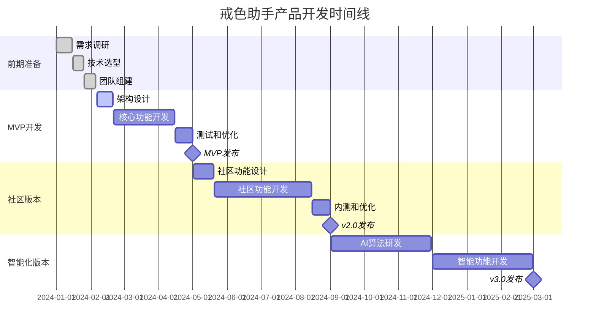

# 戒色助手 - 产品路线图 (Product Roadmap)

## 文档信息

**文档版本**: 1.0  
**创建日期**: 2024-01-XX  
**最后更新**: 2024-01-XX  
**负责人**: 产品经理  
**评审状态**: 待评审  

---

## 目录

1. [路线图概述](#1-路线图概述)
2. [版本规划策略](#2-版本规划策略)
3. [详细版本规划](#3-详细版本规划)
4. [功能优先级矩阵](#4-功能优先级矩阵)
5. [详细时间线计划](#5-详细时间线计划)
6. [资源规划](#6-资源规划)
7. [风险管理](#7-风险管理)

---

## 1. 路线图概述

### 1.1 产品愿景

打造中国领先的戒色辅助平台，通过科学的方法和温暖的社区，帮助用户摆脱色情内容依赖，建立健康的生活方式。

### 1.2 战略目标

- **短期目标 (0-6个月)**: 推出MVP版本，验证核心价值假设，获得初期种子用户
- **中期目标 (6-18个月)**: 完善核心功能，建立用户社区，实现产品市场契合度
- **长期目标 (18个月+)**: 成为行业标杆，拓展生态服务，探索可持续商业模式

### 1.3 核心成功指标

- **用户规模**: 第一年目标50万注册用户，10万月活用户
- **用户价值**: 30天戒色成功率达到60%以上
- **产品健康度**: 应用商店评分保持4.5分以上
- **社区活跃度**: 日均社区互动量超过1000次

---

## 2. 版本规划策略

### 2.1 发布策略

#### 敏捷迭代模式
- **冲刺周期**: 2周一个Sprint
- **版本发布**: 4-6周一个小版本，3-6个月一个大版本
- **平台策略**: 优先iOS，后续Android，最后考虑Web端

#### 用户验证驱动
- 每个版本都包含用户反馈收集和数据验证环节
- 基于真实用户行为数据调整后续功能优先级
- 建立用户共创机制，让核心用户参与产品设计

### 2.2 技术演进策略

#### 架构演进路径
- **Phase 1**: 单体应用架构，快速MVP验证
- **Phase 2**: 微服务架构，支撑业务扩展
- **Phase 3**: 云原生架构，实现弹性伸缩

#### 技术债务管理
- 每个大版本预留20%时间用于技术债务清理
- 建立代码质量门禁和自动化测试体系
- 定期进行技术架构评审和优化

---

## 3. 详细版本规划

### 3.1 MVP版本 (v1.0) - 核心价值验证

**发布时间**: 开发启动后3-4个月  
**主要目标**: 验证戒色追踪+游戏化的核心价值假设

#### 核心功能

**用户系统**
- 手机号注册/登录
- 基础个人资料设置
- 色隐指数评估问卷（20题版本）
- 隐私保护设置

**戒色追踪系统**
- 戒色天数计数器
- 每日签到功能
- 破戒记录与重新开始
- 基础数据统计（总天数、最长记录等）

**游戏化系统（简版）**
- 5级等级系统（新手→初学者→进阶者→专家→大师）
- 基础经验值系统（签到+1经验，破戒重置）
- 10个核心成就徽章
- 简单的等级展示界面

**基础设置**
- 应用锁定（指纹/面部识别）
- 推送通知设置
- 数据导出功能

#### 技术架构
- **前端**: Flutter框架，支持iOS和Android
- **后端**: Node.js + Express + PostgreSQL
- **托管**: 阿里云ECS基础版本
- **分析**: Firebase Analytics基础版

#### 验收标准
- 应用启动时间<3秒
- 核心功能可用性>99%
- 支持1000并发用户
- iOS/Android应用商店审核通过

### 3.2 社区版本 (v2.0) - 社交价值构建

**发布时间**: v1.0发布后4-6个月  
**主要目标**: 构建用户社区，增强用户粘性和归属感

#### 核心功能

**社区系统**
- 匿名发帖功能（支持文字、表情）
- 帖子点赞、评论、收藏
- 话题标签系统（#新手求助 #经验分享 #励志故事等）
- 举报和内容审核机制

**增强版游戏化**
- 扩展至20级等级系统
- 社区活跃度纳入经验值计算
- 新增20个社区相关成就
- 虚拟奖励系统（勋章、称号）

**个性化功能**
- 个人戒色数据看板
- 自定义目标设置（30天、90天、365天）
- 戒色历程时间轴
- 个性化鼓励语和提醒

**数据分析增强**
- 用户行为分析dashboard
- A/B测试框架搭建
- 用户反馈收集系统

#### 技术改进
- 引入Redis缓存层
- 实现实时消息推送
- 增加CDN加速
- 完善监控和日志系统

#### 验收标准
- 支持10000并发用户
- 社区每日新增内容>100条
- 用户7日留存率>40%
- 应用商店评分>4.0

### 3.3 智能化版本 (v3.0) - AI驱动个性化

**发布时间**: v2.0发布后6个月  
**主要目标**: 通过AI技术提供个性化支持和预警服务

#### 核心功能

**AI个性化系统**
- 基于用户行为的个性化推荐
- 破戒风险预警算法
- 智能化鼓励语生成
- 个性化戒色计划制定

**增强版紧急求助**
- 24/7智能客服助手
- 基于地理位置的紧急联系人
- 专业心理咨询师接入
- 危机干预流程优化

**高级游戏化功能**
- 完整50级等级系统
- 多维度成长体系（意志力、社交力、学习力等）
- 虚拟伙伴系统（AI宠物养成）
- 戒色挑战活动（月度、季度）

**数据洞察**
- 进阶数据分析（趋势预测、行为模式识别）
- 用户成长轨迹可视化
- 同龄人对比分析
- 行业数据报告生成

#### 技术升级
- 微服务架构重构
- 机器学习模型部署
- 大数据分析平台搭建
- GraphQL API设计

#### 验收标准
- AI推荐准确率>75%
- 破戒预警准确率>60%
- 用户30日留存率>60%
- 系统可用性>99.9%

### 3.4 生态化版本 (v4.0+) - 平台生态扩展

**发布时间**: v3.0发布后8-12个月  
**主要目标**: 构建完整的健康生活服务生态

#### 核心功能

**健康生活拓展**
- 运动健身集成
- 读书学习计划
- 冥想放松训练
- 睡眠质量监测

**专业服务接入**
- 心理咨询师平台
- 线上戒色训练营
- 专家讲座和课程
- 同城线下活动组织

**开放平台建设**
- 第三方应用集成API
- 硬件设备数据同步
- 合作伙伴生态建设
- 数据开放平台

**商业化探索**（谨慎推进）
- 高级会员服务
- 专业咨询付费服务
- 企业版团体服务
- 数据洞察报告

---

## 4. 功能优先级矩阵

### 4.1 优先级分类标准

**P0 - 必须有 (Must Have)**
- 影响核心用户价值
- 没有替代方案
- 用户强烈需求
- 技术风险低

**P1 - 应该有 (Should Have)**
- 显著提升用户体验
- 有一定替代方案
- 市场竞争需要
- 技术实现可行

**P2 - 可以有 (Could Have)**
- 锦上添花功能
- 有多种替代方案
- 用户需求不明确
- 可延期实现

### 4.2 各版本功能优先级

#### MVP版本 (v1.0) 功能优先级

| 功能模块 | 优先级 | 重要性说明 | 技术复杂度 |
|----------|--------|------------|------------|
| 用户注册/登录 | P0 | 基础必需功能 | 低 |
| 戒色天数追踪 | P0 | 核心价值功能 | 低 |
| 每日签到 | P0 | 用户参与核心 | 低 |
| 色隐指数评估 | P0 | 产品差异化 | 中 |
| 基础游戏化 | P0 | 用户激励核心 | 中 |
| 数据统计 | P1 | 用户反馈需要 | 低 |
| 应用锁定 | P1 | 隐私保护需要 | 中 |
| 推送通知 | P1 | 用户召回重要 | 低 |
| 数据备份 | P2 | 用户安心功能 | 高 |
| 主题切换 | P2 | 个性化需求 | 低 |

#### 社区版本 (v2.0) 功能优先级

| 功能模块 | 优先级 | 重要性说明 | 技术复杂度 |
|----------|--------|------------|------------|
| 社区发帖 | P0 | 社交价值核心 | 中 |
| 内容审核 | P0 | 社区安全必需 | 高 |
| 话题标签 | P0 | 内容组织需要 | 低 |
| 点赞评论 | P0 | 社区互动基础 | 中 |
| 个人看板 | P1 | 激励用户使用 | 中 |
| 自定义目标 | P1 | 个性化需求 | 低 |
| 实时消息 | P1 | 用户体验提升 | 高 |
| 举报系统 | P1 | 社区治理需要 | 中 |
| 收藏功能 | P2 | 便民功能 | 低 |
| 私信功能 | P2 | 深度社交 | 高 |

#### 智能化版本 (v3.0) 功能优先级

| 功能模块 | 优先级 | 重要性说明 | 技术复杂度 |
|----------|--------|------------|------------|
| 风险预警 | P0 | 预防破戒核心 | 高 |
| AI推荐 | P0 | 个性化核心 | 高 |
| 智能客服 | P1 | 用户服务提升 | 高 |
| 专业咨询 | P1 | 差异化服务 | 中 |
| 虚拟伙伴 | P1 | 情感陪伴 | 高 |
| 挑战活动 | P1 | 用户激励 | 中 |
| 数据洞察 | P1 | 决策支持 | 中 |
| 行为预测 | P2 | 高级分析 | 高 |
| 情绪识别 | P2 | 智能化进阶 | 高 |

---

## 5. 详细时间线计划

### 5.1 关键里程碑

### 5.2 详细开发计划

#### Phase 1: MVP开发 (2024年2月 - 5月)

**月度计划**

**2024年2月**
- Week 1-2: 技术架构设计，数据库设计，UI/UX设计
- Week 3-4: 开发环境搭建，基础框架搭建

**2024年3月**
- Week 1-2: 用户系统开发（注册、登录、个人资料）
- Week 3-4: 戒色追踪系统开发（签到、计数、统计）

**2024年4月**
- Week 1-2: 游戏化系统开发（等级、经验、成就）
- Week 3-4: 色隐指数评估系统开发

**2024年5月**
- Week 1: 集成测试、性能优化
- Week 2: 应用商店提交、发布准备

#### Phase 2: 社区版本开发 (2024年5月 - 9月)

**月度计划**

**2024年5月** (MVP发布后)
- Week 3-4: MVP用户反馈收集和分析，社区功能需求细化

**2024年6月**
- Week 1-2: 社区系统架构设计，数据库扩展
- Week 3-4: 社区发帖功能开发

**2024年7月**
- Week 1-2: 社区互动功能开发（点赞、评论、分享）
- Week 3-4: 内容审核系统开发

**2024年8月**
- Week 1-2: 社区管理功能开发，实时通信集成
- Week 3-4: 用户增长功能开发（邀请、分享）

**2024年9月**
- Week 1: 社区版本集成测试和优化
- Week 2: v2.0发布

#### Phase 3: 智能化版本开发 (2024年9月 - 2025年3月)

**季度计划**

**2024年Q4**
- 机器学习模型研发和训练
- 数据分析平台搭建
- AI推荐算法开发

**2025年Q1**
- 风险预警系统开发
- 智能客服系统集成
- 高级游戏化功能完善
- v3.0发布

### 5.3 发布节奏

#### 版本命名规则
- **主版本**: X.0（重大功能更新）
- **次版本**: X.Y（功能增加和改进）
- **修订版**: X.Y.Z（Bug修复和小优化）

#### 发布频率
- **主版本**: 3-6个月
- **次版本**: 4-6周
- **修订版**: 1-2周（按需）
- **热修复**: 24小时内（紧急问题）

---

## 6. 资源规划

### 6.1 团队组织结构

#### 核心团队配置

**产品团队 (3人)**
- 产品经理 × 1（负责整体产品规划）
- UI/UX设计师 × 1（负责界面和交互设计）
- 用户研究员 × 1（负责用户调研和数据分析）

**技术团队 (6人)**
- 技术负责人 × 1（架构设计和技术决策）
- 后端工程师 × 2（API开发和系统架构）
- 移动端工程师 × 2（iOS + Android开发）
- 数据工程师 × 1（数据分析和机器学习）

**运营团队 (2人)**
- 运营经理 × 1（用户运营和社区管理）
- 内容运营 × 1（内容审核和社区建设）

#### 团队扩展计划

**MVP阶段 (5人)**
- 产品经理、UI设计师、技术负责人、后端工程师、移动端工程师

**社区版本阶段 (8人)**
- 新增：前端工程师、运营经理、内容运营

**智能化版本阶段 (11人)**
- 新增：数据工程师、测试工程师、用户研究员

### 6.2 预算规划

#### 人力成本（年度）

| 角色 | 人数 | 单月薪资(万) | 年度成本(万) |
|------|------|-------------|-------------|
| 产品经理 | 1 | 2.5 | 30 |
| UI/UX设计师 | 1 | 2.0 | 24 |
| 技术负责人 | 1 | 4.0 | 48 |
| 后端工程师 | 2 | 2.8 | 67.2 |
| 移动端工程师 | 2 | 2.8 | 67.2 |
| 数据工程师 | 1 | 3.2 | 38.4 |
| 运营人员 | 2 | 1.8 | 43.2 |
| **总计** | **10** | - | **318万** |

#### 技术基础设施成本（年度）

| 项目 | 说明 | 年度成本(万) |
|------|------|-------------|
| 云服务器 | 阿里云ECS、RDS等 | 15 |
| CDN服务 | 内容分发网络 | 8 |
| 存储服务 | 对象存储、备份 | 5 |
| 监控工具 | APM、日志分析 | 6 |
| 开发工具 | IDE、协作平台 | 4 |
| 第三方服务 | SMS、推送、分析 | 10 |
| **技术总计** | - | **48万** |

#### 市场推广成本（年度）

| 渠道 | 预算(万) | 说明 |
|------|---------|------|
| 应用商店优化 | 15 | ASO、关键词优化 |
| 内容营销 | 20 | 软文、视频、社交媒体 |
| KOL合作 | 25 | 心理健康领域意见领袖 |
| 线上广告 | 30 | 搜索引擎、信息流广告 |
| 活动营销 | 10 | 线上活动、用户活动 |
| **营销总计** | **100万** | - |

#### 总体预算分布

| 类别 | 年度预算(万) | 占比 |
|------|-------------|------|
| 人力成本 | 318 | 68.2% |
| 技术成本 | 48 | 10.3% |
| 营销成本 | 100 | 21.5% |
| **总计** | **466万** | **100%** |

### 6.3 技术资源规划

#### 开发工具和平台

**代码管理**
- Git版本控制（GitLab私有化部署）
- 代码审查工具（GitLab MR）
- 持续集成（GitLab CI/CD）

**开发环境**
- IDE许可证（IntelliJ IDEA、VS Code）
- 设计工具（Figma、Sketch）
- 项目管理（Notion、JIRA）

**测试环境**
- 自动化测试框架
- 移动设备测试云（BrowserStack）
- 性能测试工具（JMeter）

#### 第三方服务集成

**基础服务**
- 云服务提供商：阿里云
- 短信服务：阿里云短信
- 推送服务：极光推送
- 地图服务：高德地图

**分析和监控**
- 用户行为分析：Firebase Analytics
- 应用性能监控：阿里云ARMS
- 错误追踪：Sentry
- 日志分析：ELK Stack

**AI和数据服务**
- 机器学习平台：阿里云PAI
- 内容审核：阿里云内容安全
- 语音识别：科大讯飞
- 自然语言处理：百度AI

---

## 7. 风险管理

### 7.1 项目风险识别

#### 技术风险

**高风险**
- **AI算法效果不佳**: 用户行为预测和推荐算法达不到预期精度
  - 影响：用户体验下降，差异化优势缺失
  - 概率：中等（30%）
  - 应对：与高校或AI公司合作，建立技术顾问团队

- **数据安全和隐私泄露**: 用户敏感数据被恶意获取
  - 影响：用户信任崩塌，法律风险，品牌受损
  - 概率：低（10%）
  - 应对：严格数据加密，定期安全审计，购买网络安全保险

**中等风险**
- **第三方服务不稳定**: 云服务或API服务中断
  - 影响：应用功能受限，用户体验下降
  - 概率：中等（20%）
  - 应对：多云部署策略，关键服务备用方案

- **移动端适配问题**: iOS/Android系统更新导致兼容性问题
  - 影响：部分用户无法正常使用
  - 概率：高（40%）
  - 应对：建立设备测试矩阵，快速响应机制

#### 市场风险

**高风险**
- **政策监管风险**: 相关法规政策变化影响产品运营
  - 影响：可能需要大幅调整产品功能或停止运营
  - 概率：中等（25%）
  - 应对：密切关注政策动向，建立合规审查机制

- **社会接受度风险**: 目标用户群体对此类产品接受度低
  - 影响：用户增长缓慢，市场教育成本高
  - 概率：中等（30%）
  - 应对：科学化包装产品，专业机构合作背书

**中等风险**
- **竞品冲击**: 大厂推出类似产品或现有竞品快速迭代
  - 影响：市场份额被挤压，获客成本上升
  - 概率：高（50%）
  - 应对：建立技术壁垒，深耕垂直领域，建立用户粘性

- **用户留存挑战**: 戒色过程的反复性导致用户流失
  - 影响：用户生命周期缩短，运营成本上升
  - 概率：高（60%）
  - 应对：建立科学的复发预防机制，提供多元化支持服务

#### 团队风险

**中等风险**
- **核心人员离职**: 关键技术人员或产品人员离职
  - 影响：项目进度延迟，知识断档
  - 概率：中等（25%）
  - 应对：建立知识文档体系，关键岗位备份人员

- **团队协作效率**: 远程办公或跨部门协作效率低
  - 影响：开发效率下降，沟通成本上升
  - 概率：中等（30%）
  - 应对：建立标准化流程，使用协作工具，定期团建

#### 资金风险

**中等风险**
- **融资困难**: 后续融资无法按计划到位
  - 影响：资金链紧张，影响产品开发和推广
  - 概率：中等（35%）
  - 应对：多渠道融资，成本控制，收入多元化探索

### 7.2 风险应对策略

#### 风险监控机制

**技术风险监控**
- 建立技术债务定期评估机制
- 实施代码质量和性能监控
- 定期进行安全评估和渗透测试
- 建立技术预研和POC验证流程

**市场风险监控**
- 建立竞品监控和分析体系
- 定期用户调研和满意度跟踪
- 政策法规变动预警机制
- 行业趋势分析和专家咨询

**项目风险监控**
- 周度项目风险评估会议
- 关键指标实时监控dashboard
- 风险事件记录和处理流程
- 应急预案制定和演练

#### 应急预案

**技术应急预案**
- 数据备份和灾难恢复方案
- 系统降级和服务熔断机制
- 紧急发布和回滚流程
- 安全事件响应处理流程

**市场应急预案**
- 负面舆情应对公关策略
- 竞品冲击应对调整方案
- 政策变化产品调整预案
- 用户流失挽回活动方案

**团队应急预案**
- 核心人员离职交接流程
- 临时人员补充渠道
- 关键知识备份和传承
- 外部技术支持合作伙伴

### 7.3 风险影响矩阵

| 风险类型 | 发生概率 | 影响程度 | 风险等级 | 应对优先级 |
|----------|----------|----------|----------|------------|
| 数据安全泄露 | 低 | 极高 | 高 | P0 |
| 政策监管变化 | 中 | 高 | 高 | P0 |
| AI算法效果差 | 中 | 中 | 中 | P1 |
| 用户留存挑战 | 高 | 中 | 高 | P0 |
| 竞品冲击 | 高 | 中 | 高 | P0 |
| 核心人员离职 | 中 | 中 | 中 | P1 |
| 第三方服务中断 | 中 | 中 | 中 | P1 |
| 融资困难 | 中 | 高 | 高 | P1 |
| 社会接受度低 | 中 | 中 | 中 | P1 |
| 移动端适配 | 高 | 低 | 中 | P2 |

---

## 8. 成功衡量标准

### 8.1 里程碑成功标准

#### MVP版本成功标准
- 应用商店成功上架（iOS App Store + Google Play）
- 获得1000+真实用户下载和使用
- 核心功能可用性达到99%
- 用户7日留存率>30%
- 应用商店评分>4.0
- 完成种子用户反馈收集（100份有效反馈）

#### 社区版本成功标准
- 注册用户数达到10,000
- 月活跃用户数达到3,000
- 社区每日新增内容>50条
- 用户平均会话时长>5分钟
- 30日留存率>40%
- 获得产品市场契合度验证

#### 智能化版本成功标准
- 注册用户数达到50,000
- 月活跃用户数达到15,000
- AI推荐点击率>15%
- 破戒预警准确率>50%
- 用户戒色平均天数>20天
- 实现正向现金流或明确盈利模式

### 8.2 退出标准

#### 项目终止条件
- MVP版本发布6个月后，月活用户数<500
- 社区版本发布12个月后，注册用户数<5,000
- 连续6个月用户增长率<5%
- 出现重大政策风险或法律风险
- 资金链断裂且无法获得新投资

#### pivot条件
- 核心功能验收但用户反馈负面
- 市场需求与产品定位严重不匹配
- 技术实现难度超出预期且无解决方案
- 竞争环境发生根本性变化

---

## 附录

### A. 关键术语定义

- **MVP**: 最小可行产品（Minimum Viable Product）
- **PMF**: 产品市场契合度（Product Market Fit）
- **DAU/MAU**: 日活跃用户/月活跃用户
- **LTV**: 用户生命周期价值（Lifetime Value）
- **CAC**: 用户获客成本（Customer Acquisition Cost）
- **Pivot**: 商业模式或产品方向的重大调整

### B. 相关文档引用

- 《戒色助手产品需求文档 (PRD)》- 详细功能规格说明
- 《用户故事地图 (User Story Map)》- 用户需求优先级排序
- 《产品评估指标框架 (Metrics Framework)》- 成功指标定义
- 《技术架构设计文档》- 系统架构和技术选型
- 《UI/UX设计规范》- 界面设计标准

### C. 版本更新记录

| 版本 | 日期 | 更新内容 | 更新人 |
|------|------|----------|--------|
| 1.0 | 2024-01-XX | 初版路线图创建，包含3个阶段的详细规划 | 产品经理 |
| 1.1 | 2024-XX-XX | 根据用户反馈调整功能优先级 | 产品经理 |
| 1.2 | 2024-XX-XX | 更新资源预算和时间线 | 产品经理 |

---

**文档结束**

本路线图为"戒色助手"产品的战略规划文档，为产品团队提供了清晰的发展方向和执行计划。所有团队成员应定期回顾和更新本路线图，确保产品开发始终与既定战略保持一致。

在执行过程中，应当保持灵活性，根据市场反馈和用户需求适时调整计划，但核心价值主张和长期愿景应保持稳定。